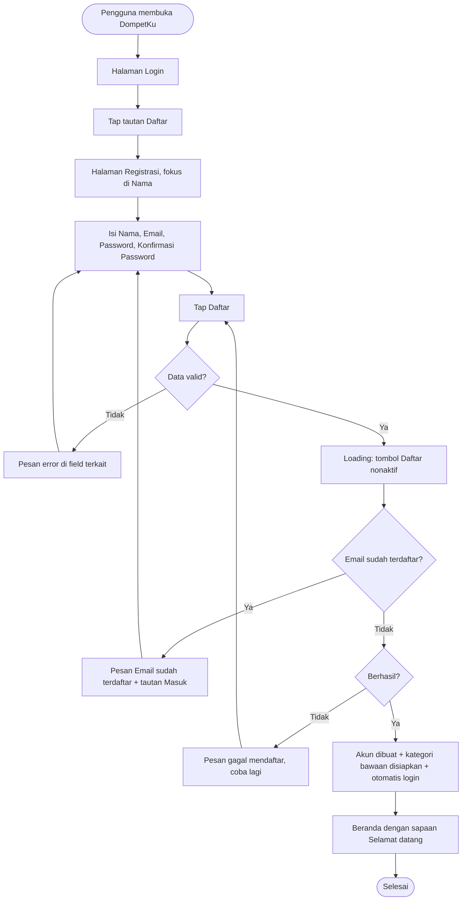

# STORY DESIGN

## Related Story

- Story: `e01-us01--registrasi-akun---story.md`
- Epic: `index.md`
- Status: Draft
- Owner: Warsono
- Figma Link: —

## User Flow



## Wireframe Description

- **Tata letak:** halaman registrasi berupa satu kolom di tengah layar. Di HP lebar penuh dengan margin 16px, di desktop berupa kartu dengan lebar maksimal ±400px. Bottom nav dan sidebar tidak tampil karena pengguna belum login.
- **Header:** logo dan nama **DompetKu**, lalu judul "Buat Akun" dan teks singkat "Catat keuanganmu dalam hitungan detik."
- **Field:** Nama, Email (keyboard email di HP), Password, dan Konfirmasi Password. Setiap field password punya ikon mata untuk menampilkan atau menyembunyikan isinya.
- **Syarat password:** di bawah field Password ada daftar syarat ("Minimal 8 karakter", "Mengandung huruf dan angka") yang berubah centang hijau saat terpenuhi.
- **Tombol:** tombol utama **Daftar** lebar penuh, dan di bawahnya teks "Sudah punya akun? **Masuk**".

## Wireframe

```text
+--------------------------------------------------+
|                  💰 DompetKu                      |
|                                                  |
|  Buat Akun                                       |
|  Catat keuanganmu dalam hitungan detik.          |
|                                                  |
|  Nama                                             |
|  [ Budi Santoso                          ] (UX-01)|
|                                                  |
|  Email                                            |
|  [ budi@example.com                      ] (UX-02)|
|  ⚠ Email sudah terdaftar. Silakan masuk.         |
|                                                  |
|  Password                                         |
|  [ ••••••••                          👁 ] (UX-03)|
|  ✔ Minimal 8 karakter                            |
|  ✖ Mengandung huruf dan angka                    |
|                                                  |
|  Konfirmasi Password                              |
|  [ ••••••••                          👁 ] (UX-04)|
|                                                  |
|  [               Daftar                   ](UX-05)|
|                                                  |
|  Sudah punya akun? Masuk                   (UX-06)|
+--------------------------------------------------+
```

## UX Interaction Markers

| Marker | Component/Input | User Action | Expected Feedback |
|--------|-----------------|-------------|-------------------|
| UX-01 | Field Nama | Mengetik | Pesan "Nama wajib diisi" jika kosong saat submit; input berhenti di 50 karakter |
| UX-02 | Field Email | Mengetik | Keyboard email di HP; pesan "Format email tidak valid" setelah field ditinggalkan (blur) jika formatnya salah |
| UX-03 | Field Password + ikon mata | Mengetik / tap ikon mata | Checklist syarat password diperbarui real-time; ikon mata menampilkan atau menyembunyikan password |
| UX-04 | Field Konfirmasi Password | Mengetik | Pesan "Konfirmasi password tidak sama" setelah blur jika tidak sama |
| UX-05 | Tombol Daftar | Tap | Tombol loading dan nonaktif; sukses berarti diarahkan ke Beranda; gagal berarti muncul pesan error |
| UX-06 | Tautan Masuk | Tap | Pindah ke halaman Login |

## States

### Default
Semua field kosong, fokus di Nama, dan checklist syarat password berwarna abu-abu.

### Loading
Tombol Daftar menampilkan spinner dan teks "Mendaftarkan...". Tombol nonaktif dan field tidak bisa diubah.

### Empty
Tidak relevan (form input).

### Error
- **Validasi:** pesan merah di bawah field terkait, misalnya "Nama wajib diisi", "Format email tidak valid", "Password belum memenuhi syarat", atau "Konfirmasi password tidak sama".
- **Email terdaftar:** pesan di bawah field Email, "Email sudah terdaftar. Silakan masuk.", dengan kata "masuk" sebagai tautan.
- **Sistem:** banner di atas tombol Daftar berisi "Gagal mendaftar. Periksa koneksi lalu coba lagi."

### Success
Pengguna tiba di Beranda dengan toast "Selamat datang, Budi!". Beranda menampilkan kondisi kosong (belum ada transaksi) dan ajakan untuk mencatat transaksi pertama.

## Open UX Questions

- Perlukah field Konfirmasi Password, atau cukup satu field password dengan ikon mata untuk mempersingkat registrasi?
- Apakah Beranda perlu menampilkan tur singkat (onboarding) untuk pengguna baru?

---

<!--
FILE LOCATION: docs/features/phase-01-mvp/e-01---akun-keamanan/e01-us01--registrasi-akun---design.md

RELATED FILES:
- e01-us01--registrasi-akun---story.md
- e01-us01--registrasi-akun---testing.md
-->
