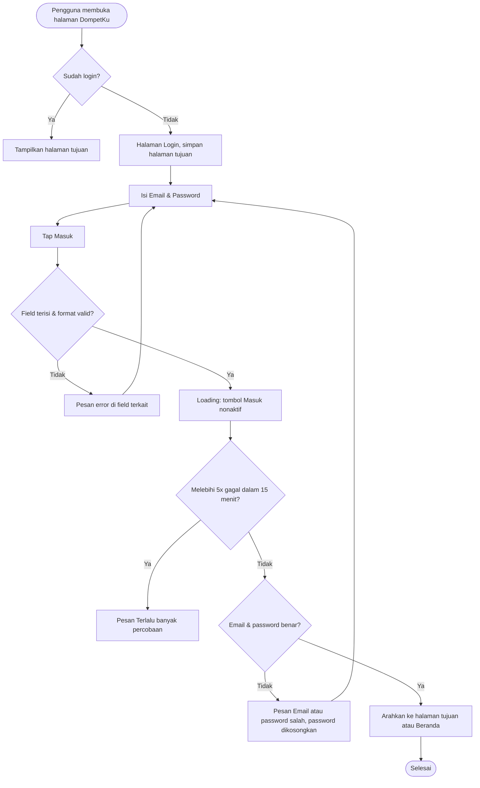
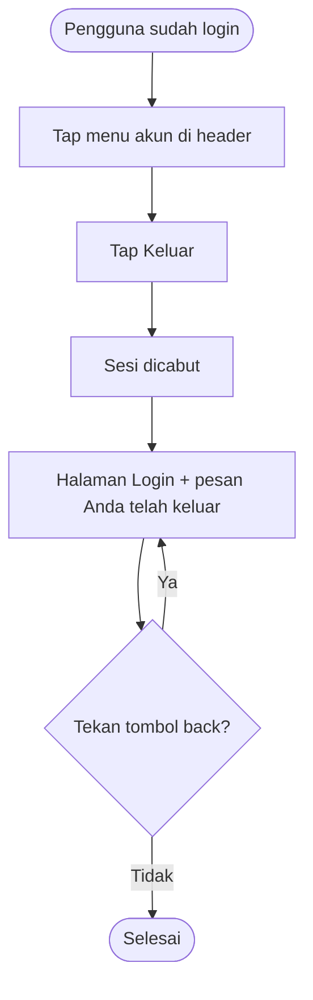

# STORY DESIGN

## Related Story

- Story: `e01-us02--login-logout---story.md`
- Epic: `index.md`
- Status: Draft
- Owner: Warsono
- Figma Link: —

## User Flow

### Login



### Logout



## Wireframe Description

- **Tata letak halaman login:** sama dengan halaman registrasi, yaitu satu kolom di tengah. Bottom nav dan sidebar tidak tampil.
- **Header:** logo **DompetKu**, lalu judul "Masuk" dan teks "Selamat datang kembali."
- **Field:** Email dan Password (dengan ikon mata), lalu tombol utama **Masuk** lebar penuh. Di bawahnya ada teks "Belum punya akun? **Daftar**".
- **Pesan:** pesan error login dan pesan "Anda telah keluar" tampil sebagai banner di atas form.
- **Menu akun (setelah login):** di header kanan atas ada avatar berisi inisial dan nama pengguna. Tap membuka dropdown berisi nama, email, dan pilihan **Keluar**. Posisinya sama di HP dan desktop, sedangkan navigasi utama ada di bottom nav (HP) atau sidebar kiri (desktop).

## Wireframe

```text
Halaman Login:
+--------------------------------------------------+
|                  💰 DompetKu                      |
|                                                  |
|  Masuk                                           |
|  Selamat datang kembali.                         |
|                                                  |
|  ┌────────────────────────────────────────────┐  |
|  │ ⚠ Email atau password salah                │  | (UX-05)
|  └────────────────────────────────────────────┘  |
|                                                  |
|  Email                                            |
|  [ budi@example.com                      ] (UX-01)|
|                                                  |
|  Password                                         |
|  [ ••••••••                          👁 ] (UX-02)|
|                                                  |
|  [               Masuk                    ](UX-03)|
|                                                  |
|  Belum punya akun? Daftar                  (UX-04)|
+--------------------------------------------------+

Header setelah login (HP):
+--------------------------------------------------+
| DompetKu                              (BS) Budi ▾ | (UX-06)
|                                  +--------------+ |
|                                  | Budi Santoso | |
|                                  | budi@exa...  | |
|                                  | ------------ | |
|                                  | ⎋ Keluar     | | (UX-07)
|                                  +--------------+ |
| ...konten halaman...                             |
| [Beranda] [Transaksi] [Anggaran] [Laporan]       |
+--------------------------------------------------+
```

## UX Interaction Markers

| Marker | Component/Input | User Action | Expected Feedback |
|--------|-----------------|-------------|-------------------|
| UX-01 | Field Email | Mengetik | Keyboard email di HP; pesan "Email wajib diisi" atau "Format email tidak valid" saat submit |
| UX-02 | Field Password + ikon mata | Mengetik / tap ikon mata | Menampilkan atau menyembunyikan password; pesan "Password wajib diisi" jika kosong |
| UX-03 | Tombol Masuk | Tap | Tombol loading dan nonaktif; sukses berarti pindah ke halaman tujuan atau Beranda; gagal berarti muncul banner error dan password dikosongkan |
| UX-04 | Tautan Daftar | Tap | Pindah ke halaman Registrasi |
| UX-05 | Banner pesan | — (otomatis) | Menampilkan "Email atau password salah", "Terlalu banyak percobaan. Coba lagi dalam 15 menit.", "Anda telah keluar", atau pesan gagal koneksi |
| UX-06 | Menu akun (avatar + nama) | Tap | Dropdown terbuka berisi nama, email, dan Keluar; tap di luar dropdown menutupnya |
| UX-07 | Pilihan Keluar | Tap | Diarahkan ke halaman Login dengan banner "Anda telah keluar" |

## States

### Default
Field Email dan Password kosong, fokus di Email, tanpa banner.

### Loading
Tombol Masuk menampilkan spinner dan teks "Masuk...". Tombol nonaktif dan field tidak bisa diubah. Saat logout, dropdown tertutup dan halaman berpindah ke Login.

### Empty
Tidak relevan (form input).

### Error
- **Validasi:** pesan merah di bawah field kosong atau yang formatnya tidak valid.
- **Kredensial salah:** banner "Email atau password salah", email tetap terisi, password dikosongkan.
- **Terkunci sementara:** banner "Terlalu banyak percobaan. Coba lagi dalam 15 menit."
- **Sistem:** banner "Gagal masuk. Periksa koneksi lalu coba lagi."

### Success
- **Login:** pengguna berada di halaman tujuan atau Beranda, dan nama pengguna tampil di menu akun.
- **Logout:** halaman Login dengan banner "Anda telah keluar".

## Open UX Questions

- Apakah perlu konfirmasi "Yakin ingin keluar?" sebelum logout, atau langsung keluar agar lebih cepat?
- Apakah halaman login perlu menampilkan informasi "Lupa password? Hubungi admin" selama fitur reset password belum ada?

---

<!--
FILE LOCATION: docs/features/phase-01-mvp/e-01---akun-keamanan/e01-us02--login-logout---design.md

RELATED FILES:
- e01-us02--login-logout---story.md
- e01-us02--login-logout---testing.md
-->
