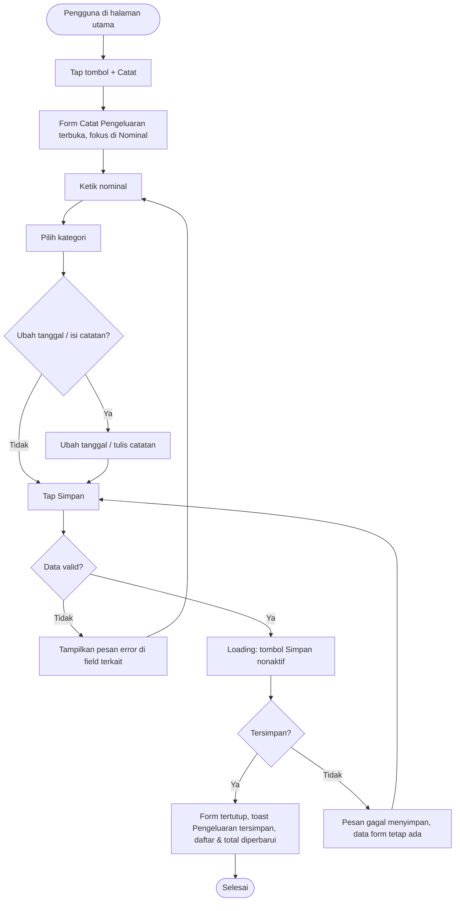

# STORY DESIGN

## Related Story

- Story: `e02-us01--catat-pengeluaran---story.md`
- Epic: `index.md`
- Status: Draft
- Owner: Warsono
- Figma Link: —

## User Flow



## Wireframe Description

- **Halaman utama:** menampilkan ringkasan bulan berjalan dan daftar transaksi terbaru. Di pojok kanan bawah ada tombol melayang (FAB) **"+"** yang mudah dijangkau jempol.
- **Navigasi:** di HP ada bottom nav 4 tab (Beranda, Transaksi, Anggaran, Laporan); di desktop berupa sidebar kiri. FAB "+" tersedia di tab Beranda dan Transaksi.
- **Membuka form:** tap "+" membuka form **Catat Pengeluaran**. Di HP form tampil sebagai *bottom sheet*, sedangkan di desktop sebagai dialog di tengah layar.
- **Toggle jenis:** di bagian atas form ada toggle **Pengeluaran | Pemasukan** dengan default Pengeluaran. Alur pemasukan dijelaskan di E02-US02.
- **Nominal:** field nominal ada paling atas, berukuran besar, dan langsung fokus dengan keyboard angka.
- **Kategori:** ditampilkan sebagai grid ikon + label, sehingga pengguna cukup satu tap untuk memilih.
- **Tanggal:** default "Hari ini", dan bisa diubah lewat date picker.
- **Catatan:** field satu baris yang opsional.
- **Tombol:** tombol utama **Simpan** berada di bawah, lebar penuh. Tombol **Batal** (atau ikon ✕) ada di header form.

## Wireframe

```text
+--------------------------------------------------+
| ✕  Catat Pengeluaran                             |
|  [ ● Pengeluaran | Pemasukan ]                   |
|--------------------------------------------------|
|  Nominal                                          |
|  Rp [ 25.000                              ]  (UX-01)
|  ⚠ Nominal harus lebih dari 0                     |
|                                                  |
|  Kategori                                  (UX-02)|
|  [🍜 Makan] [🚌 Transpor] [🛒 Belanja] [💡 Tagihan]|
|  [🎬 Hiburan] [💊 Kesehatan] [📦 Lainnya]          |
|                                                  |
|  Tanggal   [ Hari ini, 30 Sep 2026  ▾ ]    (UX-03)|
|  Catatan   [ Makan siang di kantor    ]    (UX-04)|
|                                        12/100    |
|                                                  |
|  [              Simpan                  ]  (UX-05)|
+--------------------------------------------------+

Halaman utama:
+--------------------------------------------------+
| DompetKu                     September 2026      |
| Pengeluaran bulan ini: Rp 1.250.000              |
| ------------------------------------------------ |
| 30 Sep  🍜 Makan siang         - Rp 25.000       |
| 29 Sep  🚌 Ojek                - Rp 18.000       |
|                                            [ + ] | (UX-06)
|--------------------------------------------------|
| [Beranda] [Transaksi] [Anggaran] [Laporan]       |
+--------------------------------------------------+
```

## UX Interaction Markers

| Marker | Component/Input | User Action | Expected Feedback |
|--------|-----------------|-------------|-------------------|
| UX-01 | Field Nominal | Mengetik angka | Format otomatis `Rp 25.000`; keyboard numerik di HP; pesan error inline jika 0/kosong/melebihi batas |
| UX-02 | Grid Kategori | Tap salah satu kategori | Kategori terpilih ter-highlight (hanya satu yang aktif); pesan error jika belum dipilih saat Simpan |
| UX-03 | Pilih Tanggal | Tap lalu pilih tanggal | Tanggal setelah hari ini tidak bisa dipilih; label berubah menjadi tanggal yang dipilih |
| UX-04 | Field Catatan | Mengetik teks | Counter karakter `n/100`; input berhenti di 100 karakter |
| UX-05 | Tombol Simpan | Tap | Tombol menjadi loading dan nonaktif; jika sukses form tertutup dan muncul toast "Pengeluaran tersimpan"; jika gagal muncul pesan error dan data tetap ada |
| UX-06 | FAB "+" di Beranda / Transaksi | Tap | Form Catat Pengeluaran terbuka dengan fokus di Nominal |
| UX-07 | Tombol ✕ / Batal | Tap | Form tertutup tanpa menyimpan; jika form sudah terisi, muncul konfirmasi "Buang perubahan?" |

## States

### Default
Form kosong, Nominal fokus, belum ada kategori terpilih, Tanggal = hari ini, Catatan kosong. Tombol Simpan aktif (validasi dijalankan saat ditekan).

### Loading
Tombol Simpan menampilkan spinner dan teks "Menyimpan...", tombol nonaktif, dan field tidak bisa diubah.

### Empty
Jika pengguna tidak punya kategori pengeluaran aktif (seharusnya tidak terjadi karena ada kategori bawaan), grid kategori menampilkan pesan "Belum ada kategori" dan tombol Simpan nonaktif.

### Error
- **Validasi:** pesan merah di bawah field terkait, misalnya "Nominal harus lebih dari 0", "Pilih kategori", atau "Tanggal tidak boleh melebihi hari ini".
- **Sistem:** banner di atas tombol Simpan berisi "Gagal menyimpan. Periksa koneksi lalu coba lagi." Data form tetap ada.

### Success
Form tertutup, toast "Pengeluaran tersimpan" muncul selama ±3 detik, transaksi baru tampil paling atas di daftar, dan total "Pengeluaran bulan ini" bertambah.

## Open UX Questions

- Apakah kategori yang paling sering dipakai perlu ditampilkan paling depan untuk mempercepat input?
- Apakah perlu tombol "Simpan & catat lagi" untuk mencatat beberapa pengeluaran berturut-turut?

---

<!--
FILE LOCATION: docs/features/phase-01-mvp/e-02---pencatatan-transaksi/e02-us01--catat-pengeluaran---design.md

RELATED FILES:
- e02-us01--catat-pengeluaran---story.md
- e02-us01--catat-pengeluaran---testing.md
-->
