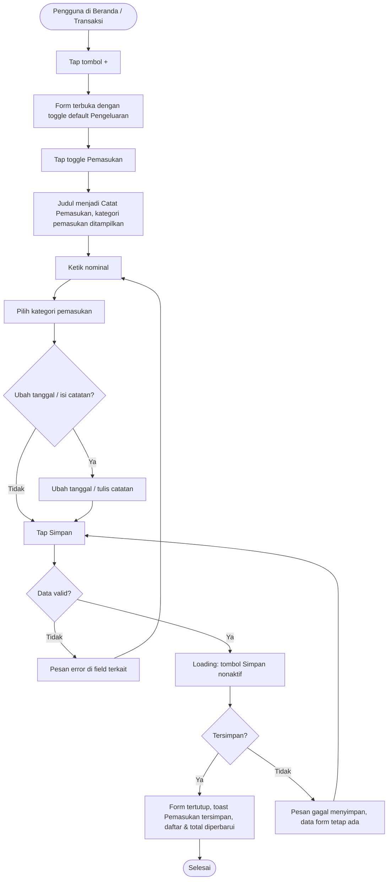

# STORY DESIGN

## Related Story

- Story: `e02-us02--catat-pemasukan---story.md`
- Epic: `index.md`
- Status: Draft
- Owner: Warsono
- Figma Link: —

## User Flow



## Wireframe Description

- **Form:** memakai form yang sama dengan E02-US01. Di HP tampil sebagai *bottom sheet*, di desktop sebagai dialog.
- **Toggle jenis:** di bawah judul ada segmented control **Pengeluaran | Pemasukan**. Jenis yang aktif diberi warna: merah untuk Pengeluaran, hijau untuk Pemasukan.
- **Saat Pemasukan aktif:**
  - judul berubah menjadi "Catat Pemasukan";
  - grid kategori menampilkan Gaji, Bonus, Hadiah, Lainnya;
  - tombol Simpan berwarna hijau.
- **Field lain:** Nominal, Tanggal, dan Catatan sama persis dengan E02-US01.
- **Di daftar transaksi:** pemasukan tampil dengan nominal berwarna hijau dan tanda **+** (contoh: `+ Rp 8.000.000`), sedangkan pengeluaran berwarna merah dengan tanda **−**.

## Wireframe

```text
+--------------------------------------------------+
| ✕  Catat Pemasukan                               |
|  [ Pengeluaran | ● Pemasukan ]             (UX-01)|
|--------------------------------------------------|
|  Nominal                                          |
|  Rp [ 8.000.000                           ]  (UX-02)
|                                                  |
|  Kategori                                  (UX-03)|
|  [💼 Gaji] [🎁 Bonus] [🎀 Hadiah] [📦 Lainnya]      |
|                                                  |
|  Tanggal   [ Hari ini, 30 Sep 2026  ▾ ]          |
|  Catatan   [ Gaji September           ]          |
|                                        14/100    |
|                                                  |
|  [          Simpan (hijau)              ]  (UX-04)|
+--------------------------------------------------+

Daftar setelah disimpan:
| 30 Sep  💼 Gaji September    + Rp 8.000.000 (hijau)|
| 30 Sep  🍜 Makan siang       − Rp 25.000   (merah) |
```

## UX Interaction Markers

| Marker | Component/Input | User Action | Expected Feedback |
|--------|-----------------|-------------|-------------------|
| UX-01 | Toggle Pengeluaran / Pemasukan | Tap "Pemasukan" | Judul menjadi "Catat Pemasukan", grid kategori berganti ke kategori pemasukan, pilihan kategori sebelumnya dikosongkan, nominal & catatan tetap ada, warna aksen menjadi hijau |
| UX-02 | Field Nominal | Mengetik angka | Format otomatis `Rp 8.000.000`; aturan validasi sama dengan E02-US01 |
| UX-03 | Grid Kategori Pemasukan | Tap salah satu kategori | Kategori terpilih ter-highlight; pesan "Pilih kategori" jika belum dipilih saat Simpan |
| UX-04 | Tombol Simpan | Tap | Loading & nonaktif; sukses → form tertutup, toast "Pemasukan tersimpan"; gagal → pesan error, data tetap ada |
| UX-05 | Toggle kembali ke Pengeluaran | Tap "Pengeluaran" | Judul & kategori kembali ke mode pengeluaran; kategori pemasukan yang tadi dipilih dikosongkan |

## States

### Default
Form terbuka dengan toggle **Pengeluaran**. Setelah pengguna memilih Pemasukan: nominal fokus, belum ada kategori terpilih, tanggal = hari ini.

### Loading
Tombol Simpan menampilkan spinner dan teks "Menyimpan...", tombol nonaktif, dan field tidak bisa diubah.

### Empty
Jika pengguna tidak punya kategori pemasukan aktif, grid menampilkan "Belum ada kategori pemasukan", tautan "Kelola kategori" (E02-US05), dan tombol Simpan nonaktif.

### Error
- **Validasi:** pesan merah di bawah field terkait (sama dengan E02-US01).
- **Sistem:** "Gagal menyimpan. Periksa koneksi lalu coba lagi." Data form tetap ada.

### Success
Form tertutup, toast "Pemasukan tersimpan" muncul, transaksi hijau bertanda **+** tampil paling atas di daftar, dan total pemasukan bulan berjalan bertambah.

## Open UX Questions

- Apakah form sebaiknya mengingat jenis terakhir yang dipakai, alih-alih selalu default Pengeluaran?
- Apakah perlu shortcut terpisah (misalnya long-press FAB) untuk langsung membuka mode Pemasukan?

---

<!--
FILE LOCATION: docs/features/phase-01-mvp/e-02---pencatatan-transaksi/e02-us02--catat-pemasukan---design.md

RELATED FILES:
- e02-us02--catat-pemasukan---story.md
- e02-us02--catat-pemasukan---testing.md
-->
