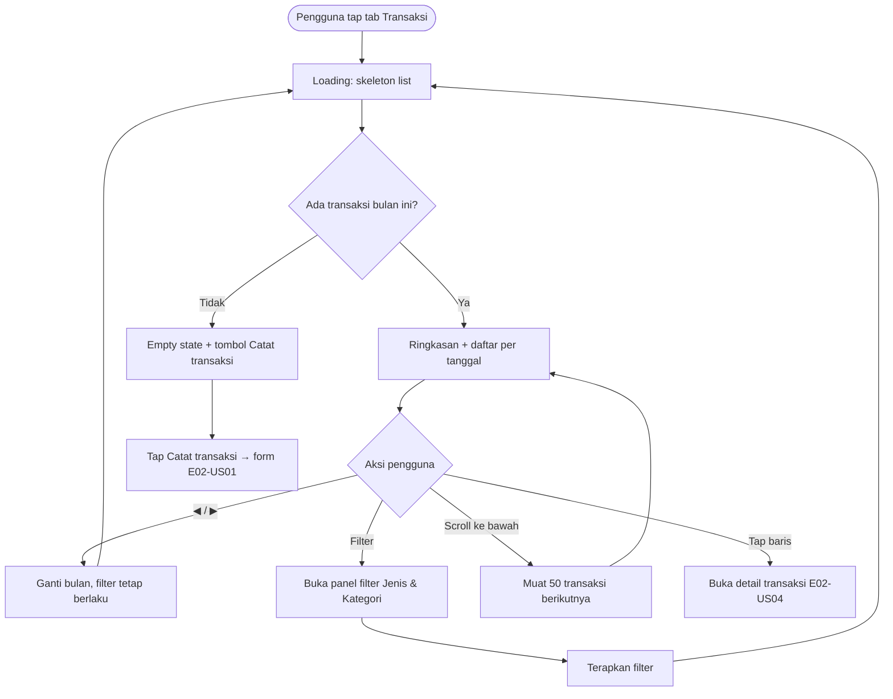

# STORY DESIGN

## Related Story

- Story: `e02-us03--daftar-transaksi---story.md`
- Epic: `index.md`
- Status: Draft
- Owner: Warsono
- Figma Link: —

## User Flow



## Wireframe Description

- **Header:** judul "Transaksi" dan tombol ikon **Filter** (dengan badge jumlah filter aktif).
- **Navigasi bulan:** ◀ Nama Bulan Tahun ▶ di bawah header.
- **Chip filter:** baris chip filter aktif yang bisa di-scroll horizontal, masing-masing dengan tombol ✕.
- **Kartu ringkasan:** tiga angka, yaitu Pemasukan (hijau), Pengeluaran (merah), dan Selisih.
- **Daftar:** dikelompokkan per tanggal. Setiap header tanggal juga menampilkan total bersih hari itu di sisi kanan.
- **Panel filter:** di HP berupa *bottom sheet*, di desktop berupa popover. Isinya:
  - segmented control **Jenis** (Semua / Pengeluaran / Pemasukan);
  - daftar **Kategori** dengan checkbox. Kategori terarsip dikelompokkan di bagian bawah dengan label "Diarsipkan".
  - tombol **Reset** dan **Terapkan**.
- **Navigasi & FAB:** bottom nav (HP) atau sidebar (desktop), dengan FAB "+" di kanan bawah.

## Wireframe

```text
+--------------------------------------------------+
| Transaksi                          [⚙ Filter (2)]| (UX-03)
|        [◀]   September 2026   [▶ disabled]       | (UX-01, UX-02)
| [Pengeluaran ✕] [Makan & Minum ✕]  Reset filter  | (UX-04)
|--------------------------------------------------|
| Pemasukan      Pengeluaran        Selisih        |
| Rp 0           Rp 1.250.000      − Rp 1.250.000  |
|--------------------------------------------------|
| Rabu, 30 Sep 2026                   − Rp 43.000  |
|  🍜 Makan siang                     − Rp 25.000   | (UX-05)
|  🍜 Kopi                            − Rp 18.000   |
| Selasa, 29 Sep 2026                 − Rp 60.000  |
|  🍜 Makan & Minum                   − Rp 60.000   |
|   ... (infinite scroll)                           | (UX-06)
|                                            [ + ] |
|--------------------------------------------------|
| [Beranda] [●Transaksi] [Anggaran] [Laporan]      |
+--------------------------------------------------+

Panel filter (bottom sheet):
+--------------------------------------------------+
| Filter                                        ✕  |
| Jenis   [ Semua | ● Pengeluaran | Pemasukan ]    |
| Kategori                                          |
|  [x] 🍜 Makan & Minum    [ ] 🚌 Transportasi       |
|  [ ] 🛒 Belanja          [ ] 💡 Tagihan            |
|  Diarsipkan: [ ] 🎮 Game                          |
| [ Reset ]                        [ Terapkan ]    |
+--------------------------------------------------+
```

## UX Interaction Markers

| Marker | Component/Input | User Action | Expected Feedback |
|--------|-----------------|-------------|-------------------|
| UX-01 | Tombol ◀ bulan sebelumnya | Tap | Label bulan berubah; daftar & ringkasan dimuat ulang (skeleton); filter tetap |
| UX-02 | Tombol ▶ bulan berikutnya | Tap | Pindah ke bulan berikutnya; nonaktif (abu-abu) saat di bulan berjalan |
| UX-03 | Tombol Filter | Tap | Panel filter terbuka dengan pilihan saat ini; badge menunjukkan jumlah filter aktif |
| UX-04 | Chip filter aktif / Reset filter | Tap ✕ pada chip / tap Reset | Filter terkait dilepas; daftar & ringkasan diperbarui |
| UX-05 | Baris transaksi | Tap | Membuka detail transaksi (E02-US04) |
| UX-06 | Ujung daftar | Scroll ke bawah | Indikator loading kecil di bawah, lalu 50 transaksi berikutnya muncul; tidak ada lagi → teks "Semua transaksi sudah ditampilkan" |
| UX-07 | Pilihan Jenis di panel filter | Tap Pengeluaran/Pemasukan | Daftar kategori di panel hanya menampilkan kategori jenis tersebut |

## States

### Default
Bulan berjalan, tanpa filter, ringkasan terisi, daftar transaksi terbaru di atas.

### Loading
Skeleton untuk kartu ringkasan dan 5 baris daftar. Saat memuat halaman berikutnya, spinner kecil tampil di bagian bawah daftar.

### Empty
- **Tanpa filter:** ilustrasi dompet kosong, teks "Belum ada transaksi di September 2026", dan tombol **Catat transaksi**.
- **Dengan filter:** teks "Tidak ada transaksi yang cocok dengan filter" dan tombol **Reset filter**.
- **Ringkasan:** semua angka menampilkan Rp 0.

### Error
Jika gagal memuat, muncul pesan "Gagal memuat transaksi." dengan tombol **Coba lagi**. Data yang sudah tampil sebelumnya tetap ada.

### Success
Daftar dan ringkasan tampil sesuai periode dan filter. Setelah pengguna mencatat, mengubah, atau menghapus transaksi, daftar langsung diperbarui tanpa reload manual.

## Open UX Questions

- Apakah filter perlu diingat saat pengguna keluar lalu kembali ke tab Transaksi?
- Apakah perlu pencarian teks catatan di iterasi berikutnya?

---

<!--
FILE LOCATION: docs/features/phase-01-mvp/e-02---pencatatan-transaksi/e02-us03--daftar-transaksi---design.md

RELATED FILES:
- e02-us03--daftar-transaksi---story.md
- e02-us03--daftar-transaksi---testing.md
-->
