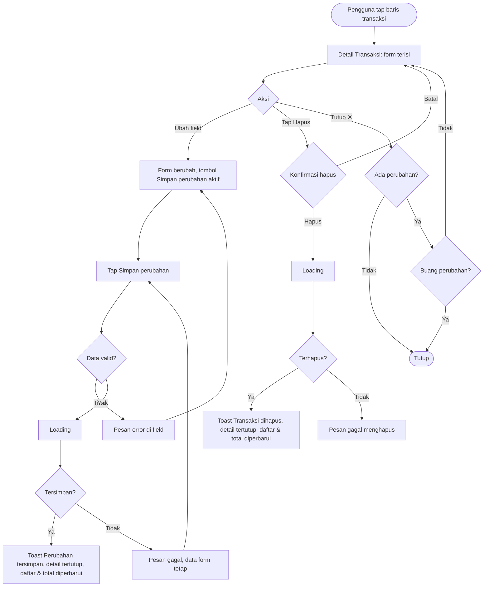

# STORY DESIGN

## Related Story

- Story: `e02-us04--ubah-hapus-transaksi---story.md`
- Epic: `index.md`
- Status: Draft
- Owner: Warsono
- Figma Link: —

## User Flow



## Wireframe Description

- **Tampilan detail:** di HP berupa *bottom sheet*, di desktop berupa dialog, sama seperti form catat.
- **Isi form:** judul **Detail Transaksi** dan toggle jenis. Nominal, kategori, tanggal, dan catatan sudah terisi.
- **Info tambahan:** di bawah form ada teks kecil "Dicatat 30 Sep 2026, 12:15" sebagai informasi waktu pencatatan.
- **Tombol aksi:**
  - **Simpan perubahan**: tombol utama, lebar penuh, nonaktif sampai ada perubahan;
  - **Hapus**: tombol teks merah dengan ikon tempat sampah, di bawah tombol simpan.
- **Konfirmasi hapus:** berupa dialog yang menampilkan ringkasan transaksi, misalnya "🍜 Makan siang − Rp 25.000, 30 Sep 2026", dengan tombol **Batal** dan **Hapus** (merah).
- **Kategori terarsip:** chip kategori tampil dengan label "Diarsipkan" dan hanya tampil untuk transaksi yang memang memakai kategori tersebut.

## Wireframe

```text
+--------------------------------------------------+
| ✕  Detail Transaksi                              | (UX-06)
|  [ ● Pengeluaran | Pemasukan ]                   | (UX-02)
|--------------------------------------------------|
|  Nominal                                          |
|  Rp [ 25.000                              ]  (UX-01)
|  Kategori                                         |
|  [🍜 Makan ✓] [🚌 Transpor] [🛒 Belanja] [💡 Tagihan]|
|  [🎬 Hiburan] [💊 Kesehatan] [📦 Lainnya]          |
|  Tanggal   [ 30 Sep 2026            ▾ ]          |
|  Catatan   [ Makan siang              ]          |
|  Dicatat 30 Sep 2026, 12:15                      |
|                                                  |
|  [       Simpan perubahan (disabled)    ]  (UX-03)|
|            🗑 Hapus transaksi                (UX-04)|
+--------------------------------------------------+

Konfirmasi hapus:
+----------------------------------------------+
| Hapus transaksi ini?                         |
| 🍜 Makan siang   − Rp 25.000   30 Sep 2026   |
| Tindakan ini tidak bisa dibatalkan.          |
|              [ Batal ]   [ Hapus ]   (UX-05) |
+----------------------------------------------+
```

## UX Interaction Markers

| Marker | Component/Input | User Action | Expected Feedback |
|--------|-----------------|-------------|-------------------|
| UX-01 | Field Nominal / Tanggal / Catatan | Mengubah nilai | Tombol Simpan perubahan menjadi aktif; validasi sama dengan E02-US01 |
| UX-02 | Toggle jenis | Tap jenis lain | Grid kategori berganti, kategori terpilih dikosongkan, pesan "Pilih kategori" saat Simpan jika belum dipilih |
| UX-03 | Tombol Simpan perubahan | Tap | Loading; sukses → toast "Perubahan tersimpan", detail tertutup, daftar & total diperbarui |
| UX-04 | Tombol Hapus transaksi | Tap | Dialog konfirmasi hapus terbuka |
| UX-05 | Tombol Hapus di dialog | Tap | Loading; sukses → toast "Transaksi dihapus", detail tertutup, transaksi hilang dari daftar |
| UX-06 | Tombol ✕ | Tap | Tutup langsung jika tidak ada perubahan; jika ada perubahan, muncul "Buang perubahan?" |

## States

### Default
Form terisi data transaksi, tombol Simpan perubahan nonaktif, tombol Hapus aktif.

### Loading
- **Saat membuka detail:** skeleton form.
- **Saat menyimpan atau menghapus:** tombol terkait menampilkan spinner dan semua input nonaktif.

### Empty
Jika transaksi tidak ditemukan (sudah dihapus atau bukan milik pengguna), muncul pesan "Transaksi tidak ditemukan" dengan tombol **Kembali ke daftar**.

### Error
- **Validasi:** pesan merah di bawah field terkait.
- **Gagal simpan:** "Gagal menyimpan perubahan. Coba lagi." Data form tetap ada.
- **Gagal hapus:** "Gagal menghapus transaksi. Coba lagi." Transaksi tetap ada.

### Success
Toast "Perubahan tersimpan" atau "Transaksi dihapus", detail tertutup, lalu daftar, ringkasan, dan Beranda diperbarui.

## Open UX Questions

- Apakah perlu opsi "Urungkan" (undo) selama beberapa detik setelah menghapus, sebagai pengganti atau pelengkap dialog konfirmasi?
- Apakah swipe-to-delete di daftar (HP) diperlukan, atau cukup dari halaman detail?

---

<!--
FILE LOCATION: docs/features/phase-01-mvp/e-02---pencatatan-transaksi/e02-us04--ubah-hapus-transaksi---design.md

RELATED FILES:
- e02-us04--ubah-hapus-transaksi---story.md
- e02-us04--ubah-hapus-transaksi---testing.md
-->
