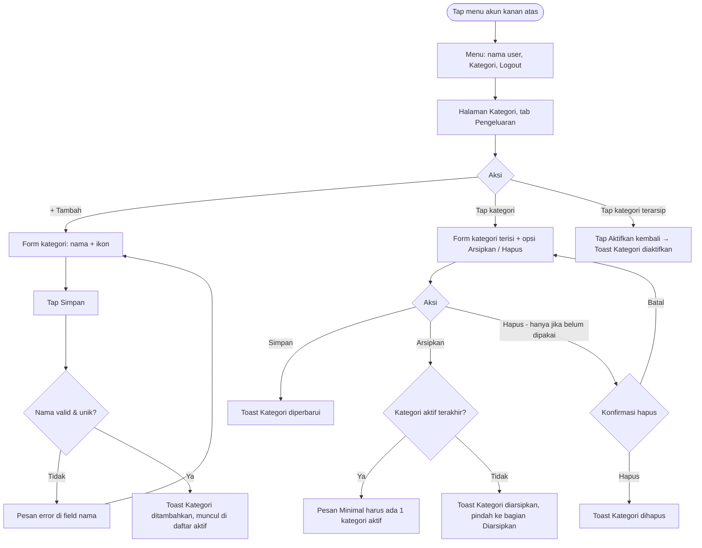

# STORY DESIGN

## Related Story

- Story: `e02-us05--kelola-kategori---story.md`
- Epic: `index.md`
- Status: Draft
- Owner: Warsono
- Figma Link: —

## User Flow



## Wireframe Description

- **Menu akun:** tombol avatar/nama di kanan atas header membuka dropdown berisi nama pengguna, **Kategori**, dan **Logout**.
- **Halaman Kategori:**
  - judul, lalu segmented tab **Pengeluaran | Pemasukan**;
  - daftar kategori aktif dengan ikon, nama, dan jumlah transaksi (contoh: "12 transaksi");
  - bagian **Diarsipkan** yang bisa dilipat, di bawah daftar aktif;
  - tombol **+ Tambah kategori** di bagian atas daftar.
- **Form kategori:** di HP berupa *bottom sheet*, di desktop berupa dialog. Isinya:
  - field **Nama** dengan counter `n/30`;
  - grid **Ikon** (±24 pilihan emoji/ikon);
  - tombol **Simpan**.
- **Mode ubah:** di bawah tombol Simpan ada satu aksi tambahan:
  - **Hapus kategori** (merah) jika kategori belum pernah dipakai;
  - **Arsipkan kategori** (abu-abu) jika sudah dipakai, dengan teks bantuan "Kategori ini dipakai di 12 transaksi, sehingga tidak bisa dihapus. Arsipkan untuk menyembunyikannya dari form."
  - Kategori yang belum dipakai juga bisa diarsipkan lewat menu ⋯.
- **Kategori terarsip:** tampil redup. Saat ditap, muncul aksi **Aktifkan kembali**.

## Wireframe

```text
+--------------------------------------------------+
| DompetKu                          [👤 Budi ▾]    | (UX-01)
|                                   | Budi          |
|                                   | Kategori      |
|                                   | Logout        |
|--------------------------------------------------|
| Kategori                                          |
| [ ● Pengeluaran | Pemasukan ]                    | (UX-02)
| [ + Tambah kategori ]                            | (UX-03)
|  🍜 Makan & Minum            12 transaksi    ›   | (UX-05)
|  🚌 Transportasi              8 transaksi    ›   |
|  🛒 Belanja                   3 transaksi    ›   |
|  ☕ Kopi (custom)             0 transaksi    ›   |
|  ...                                              |
| ▾ Diarsipkan (1)                                  |
|  🎮 Game (redup)              4 transaksi  [Aktifkan kembali] | (UX-08)
|--------------------------------------------------|
| [Beranda] [Transaksi] [Anggaran] [Laporan]       |
+--------------------------------------------------+

Form ubah kategori (sudah dipakai):
+--------------------------------------------------+
| ✕  Ubah Kategori                                 |
|  Nama  [ Makan & Minum          ]  13/30  (UX-04)|
|  Ikon  [🍜✓][☕][🍔][🚌][🛒][💡][🎬][💊] ...       |
|  [               Simpan                 ]        |
|  Arsipkan kategori                         (UX-06)|
|  Kategori ini dipakai di 12 transaksi,           |
|  sehingga tidak bisa dihapus.                    |
+--------------------------------------------------+
```

## UX Interaction Markers

| Marker | Component/Input | User Action | Expected Feedback |
|--------|-----------------|-------------|-------------------|
| UX-01 | Menu akun | Tap → pilih "Kategori" | Navigasi ke halaman Kategori |
| UX-02 | Tab Pengeluaran / Pemasukan | Tap | Daftar berganti sesuai jenis |
| UX-03 | Tombol + Tambah kategori | Tap | Form kategori kosong terbuka, jenis mengikuti tab aktif, fokus di Nama |
| UX-04 | Field Nama | Mengetik | Counter `n/30`; pesan "Nama wajib diisi" / "Nama kategori sudah ada" saat Simpan |
| UX-05 | Baris kategori aktif | Tap | Form ubah kategori terisi |
| UX-06 | Arsipkan kategori | Tap | Kategori pindah ke bagian Diarsipkan + toast "Kategori diarsipkan"; jika kategori aktif terakhir → pesan "Minimal harus ada 1 kategori aktif" |
| UX-07 | Hapus kategori (hanya jika 0 transaksi) | Tap → konfirmasi | Dialog "Hapus kategori Kopi?"; setelah Hapus → toast "Kategori dihapus" |
| UX-08 | Aktifkan kembali | Tap | Kategori kembali ke daftar aktif + toast "Kategori diaktifkan" |
| UX-09 | Grid Ikon | Tap ikon | Ikon terpilih ter-highlight; pratinjau ikon di samping nama |

## States

### Default
Tab Pengeluaran aktif, kategori aktif diurutkan berdasarkan nama, dan bagian Diarsipkan tertutup (menampilkan jumlahnya).

### Loading
Skeleton daftar kategori. Saat menyimpan, mengarsipkan, atau menghapus, tombol terkait menampilkan spinner dan nonaktif.

### Empty
Bagian Diarsipkan disembunyikan jika tidak ada kategori terarsip. Daftar aktif tidak mungkin kosong karena minimal selalu ada 1 kategori aktif.

### Error
- **Validasi:** "Nama wajib diisi", "Nama maksimal 30 karakter", "Nama kategori sudah ada", atau "Pilih ikon".
- **Aturan bisnis:** "Minimal harus ada 1 kategori aktif".
- **Sistem:** "Gagal menyimpan. Coba lagi." Data tidak berubah.

### Success
Toast sesuai aksi. Daftar kategori, pilihan kategori di form transaksi, dan tampilan transaksi yang memakai kategori tersebut ikut diperbarui.

## Open UX Questions

- Apakah jumlah kategori per jenis perlu dibatasi (misalnya maksimal 30) agar grid di form transaksi tetap ringkas?
- Apakah pengguna perlu bisa mengatur urutan kategori, atau cukup urut abjad / paling sering dipakai?

---

<!--
FILE LOCATION: docs/features/phase-01-mvp/e-02---pencatatan-transaksi/e02-us05--kelola-kategori---design.md

RELATED FILES:
- e02-us05--kelola-kategori---story.md
- e02-us05--kelola-kategori---testing.md
-->
