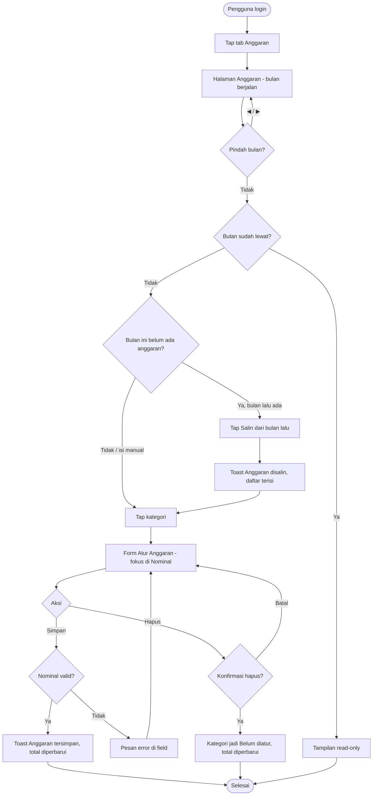

# STORY DESIGN

## Related Story

- Story: `e03-us01--atur-anggaran-kategori---story.md`
- Epic: `index.md`
- Status: Draft
- Owner: Warsono
- Figma Link: —

## User Flow



## Wireframe Description

- **Header:** di bagian atas ada pemilih bulan: tombol ◀, label bulan (misalnya "Oktober 2026"), dan tombol ▶. Di bawahnya ada kartu **Total anggaran** bulan tersebut.
- **Daftar kategori:** berisi semua kategori pengeluaran aktif. Setiap baris menampilkan ikon, nama kategori, dan nominal anggaran di sisi kanan, atau label abu-abu "Belum diatur".
- **Form anggaran:** tap baris kategori membuka form **Atur Anggaran**. Di HP form tampil sebagai bottom sheet, di desktop sebagai dialog. Form berisi field nominal besar (fokus otomatis, keyboard numerik), tombol **Simpan** lebar penuh, dan tombol **Hapus anggaran** berwarna merah yang hanya muncul jika kategori sudah punya anggaran.
- **Salin dari bulan lalu:** jika bulan yang dibuka belum punya anggaran sama sekali, muncul kartu kosong berisi pesan "Belum ada anggaran untuk bulan ini" dan tombol **Salin dari bulan lalu** (jika bulan lalu punya anggaran).
- **Bulan yang sudah lewat:** muncul label "Hanya lihat" di dekat nama bulan, dan baris kategori tidak bisa ditap.
- **Navigasi:** bottom nav (Beranda, Transaksi, **Anggaran**, Laporan) di HP, atau sidebar kiri di desktop.

## Wireframe

```text
+--------------------------------------------------+
| DompetKu                                 [Akun ▾] |
|--------------------------------------------------|
|        [◀]   Oktober 2026   [▶]           (UX-01) |
|  +--------------------------------------------+  |
|  | Total anggaran             Rp 4.500.000    |  |(UX-02)
|  +--------------------------------------------+  |
|                                                  |
|  🍜 Makan & Minum              Rp 1.500.000   ›  |(UX-03)
|  🚌 Transportasi                 Rp 600.000   ›  |
|  🛒 Belanja                    Rp 1.000.000   ›  |
|  💡 Tagihan                    Rp 1.400.000   ›  |
|  🎬 Hiburan                     Belum diatur  ›  |
|  💊 Kesehatan                   Belum diatur  ›  |
|  📦 Lainnya                     Belum diatur  ›  |
|--------------------------------------------------|
| [Beranda] [Transaksi] [Anggaran] [Laporan]       |
+--------------------------------------------------+

Bulan tanpa anggaran:
+--------------------------------------------------+
|        [◀]   November 2026   [▶]                  |
|  Belum ada anggaran untuk bulan ini              |
|  [      Salin dari bulan lalu (Okt 2026)     ]   |(UX-04)
|  atau tap kategori di bawah untuk atur manual    |
+--------------------------------------------------+

Form Atur Anggaran (bottom sheet):
+--------------------------------------------------+
| ✕  Anggaran Makan & Minum — Oktober 2026          |
|--------------------------------------------------|
|  Nominal                                          |
|  Rp [ 1.500.000                          ]  (UX-05)
|  ⚠ Nominal harus lebih dari 0                     |
|                                                  |
|  [              Simpan                  ]  (UX-06)|
|  [          Hapus anggaran              ]  (UX-07)|
+--------------------------------------------------+
```

## UX Interaction Markers

| Marker | Component/Input | User Action | Expected Feedback |
|--------|-----------------|-------------|-------------------|
| UX-01 | Pemilih bulan ◀ ▶ | Tap | Daftar dan total berganti ke bulan terpilih; ▶ nonaktif di bulan depan (maksimal 1 bulan ke depan); bulan lampau menampilkan label "Hanya lihat" |
| UX-02 | Kartu Total anggaran | — (tampilan) | Nilai langsung diperbarui setelah simpan, ubah, hapus, atau salin |
| UX-03 | Baris kategori | Tap | Form Atur Anggaran terbuka dengan nominal saat ini (jika ada); tidak bisa ditap di bulan lampau |
| UX-04 | Tombol Salin dari bulan lalu | Tap | Loading singkat; lalu daftar terisi dan muncul toast "Anggaran disalin dari Oktober 2026"; tombol hilang |
| UX-05 | Field Nominal | Mengetik angka | Format otomatis `Rp 1.500.000`; keyboard numerik; pesan error inline jika kosong/0/melebihi Rp 1.000.000.000 |
| UX-06 | Tombol Simpan | Tap | Tombol loading dan nonaktif; jika sukses form tertutup dan muncul toast "Anggaran tersimpan"; jika gagal muncul pesan error dan nominal tetap ada |
| UX-07 | Tombol Hapus anggaran | Tap | Konfirmasi "Hapus anggaran Makan & Minum untuk Oktober 2026?"; jika ya, form tertutup dan baris menjadi "Belum diatur" |

## States

### Default
Bulan berjalan tampil. Total anggaran dan daftar kategori dengan nominal atau label "Belum diatur".

### Loading
Saat berpindah bulan: skeleton pada kartu total dan daftar. Saat menyimpan, menghapus, atau menyalin: tombol terkait menampilkan spinner dan nonaktif.

### Empty
- Bulan tanpa anggaran: pesan "Belum ada anggaran untuk bulan ini", total `Rp 0`, dan tombol "Salin dari bulan lalu" jika bulan lalu punya anggaran.
- Jika bulan lalu juga kosong, yang tampil hanya ajakan "Tap kategori untuk mengatur anggaran".

### Error
- **Validasi:** pesan merah di bawah field nominal: "Nominal wajib diisi", "Nominal harus lebih dari 0", atau "Nominal maksimal Rp 1.000.000.000".
- **Sistem:** banner "Gagal menyimpan. Periksa koneksi lalu coba lagi." Nominal tetap ada di form.

### Success
Toast "Anggaran tersimpan", "Anggaran dihapus", atau "Anggaran disalin dari [bulan]". Baris kategori dan total anggaran langsung diperbarui.

## Open UX Questions

- Apakah anggaran bulan yang sudah lewat perlu bisa diubah (misalnya untuk koreksi), atau tetap read-only seperti usulan saat ini?
- Apakah "Salin dari bulan lalu" perlu tersedia juga saat bulan tersebut sudah punya sebagian anggaran (misalnya hanya menyalin kategori yang belum diatur)?
- Apakah perlu bisa mengatur anggaran lebih dari 1 bulan ke depan?

---

<!--
FILE LOCATION: docs/features/phase-01-mvp/e-03---anggaran/e03-us01--atur-anggaran-kategori---design.md

RELATED FILES:
- e03-us01--atur-anggaran-kategori---story.md
- e03-us01--atur-anggaran-kategori---testing.md
-->
