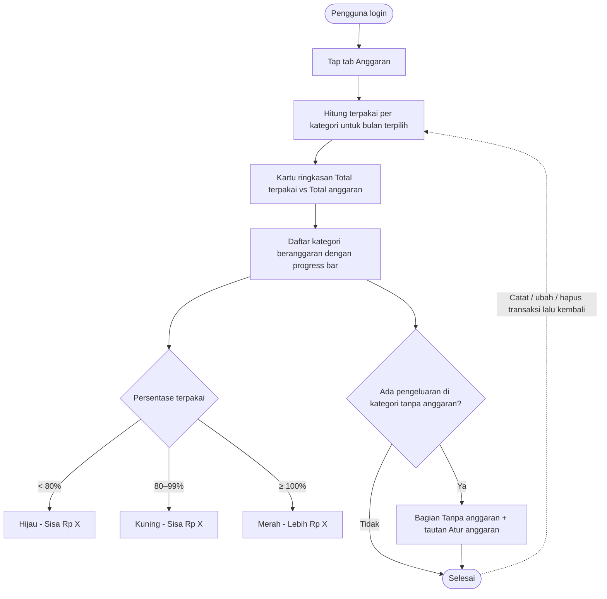

# STORY DESIGN

## Related Story

- Story: `e03-us02--indikator-pemakaian-anggaran---story.md`
- Epic: `index.md`
- Status: Draft
- Owner: Warsono
- Figma Link: —

## User Flow



## Wireframe Description

- **Tempat tampil:** indikator memperluas halaman **Anggaran** dari E03-US01, dengan pemilih bulan dan navigasi yang sama.
- **Kartu ringkasan:** berisi "Terpakai Rp X dari Rp Y", progress bar total, persentase, dan teks "Sisa Rp Z" atau "Lebih Rp Z".
- **Baris kategori beranggaran:** ikon dan nama kategori, persentase di kanan, progress bar berwarna (hijau/kuning/merah), lalu teks kecil "Rp terpakai / Rp anggaran" dan "Sisa Rp X" atau "Lebih Rp X" (merah).
- **Urutan:** baris diurutkan berdasarkan persentase tertinggi, supaya kategori yang paling kritis tampil paling atas.
- **Bagian "Tanpa anggaran":** berada di bawah daftar dan hanya muncul jika ada pengeluaran di kategori tanpa anggaran. Setiap baris menampilkan nama kategori, jumlah terpakai, dan tautan **Atur anggaran** yang membuka form E03-US01.
- **Bagian "Belum diatur":** kategori tanpa anggaran dan tanpa pengeluaran ada di bagian paling bawah.
- **Aksesibilitas:** warna tidak menjadi satu-satunya penanda. Status kuning dan merah juga punya ikon (⚠ / ⛔) dan teks.

## Wireframe

```text
+--------------------------------------------------+
| DompetKu                                 [Akun ▾] |
|--------------------------------------------------|
|        [◀]   Oktober 2026   [▶]                   |
|  +--------------------------------------------+  |
|  | Terpakai Rp 3.420.000 dari Rp 4.500.000    |  |(UX-01)
|  | [██████████████████░░░░░░]  76%            |  |
|  | Sisa Rp 1.080.000                          |  |
|  +--------------------------------------------+  |
|                                                  |
|  ⛔ 🍜 Makan & Minum                      112%   |(UX-02)
|  [████████████████████████] (merah)              |
|  Rp 1.680.000 / Rp 1.500.000    Lebih Rp 180.000 |
|                                                  |
|  ⚠ 🚌 Transportasi                         85%   |
|  [████████████████████░░░░] (kuning)             |
|  Rp 510.000 / Rp 600.000          Sisa Rp 90.000 |
|                                                  |
|  🛒 Belanja                                 40%   |
|  [██████████░░░░░░░░░░░░░░] (hijau)              |
|  Rp 400.000 / Rp 1.000.000       Sisa Rp 600.000 |
|                                                  |
|  Tanpa anggaran                                   |(UX-03)
|  🎬 Hiburan        Rp 250.000   [Atur anggaran]  |
|                                                  |
|  Belum diatur                                     |
|  💊 Kesehatan  ·  📦 Lainnya                      |
|--------------------------------------------------|
| [Beranda] [Transaksi] [Anggaran] [Laporan]       |
+--------------------------------------------------+
```

## UX Interaction Markers

| Marker | Component/Input | User Action | Expected Feedback |
|--------|-----------------|-------------|-------------------|
| UX-01 | Kartu ringkasan total | — (tampilan) | Total terpakai (semua pengeluaran bulan itu), total anggaran, persentase, dan sisa/lebih dengan warna sesuai aturan |
| UX-02 | Baris kategori beranggaran | Tap | Membuka form Atur Anggaran (E03-US01) untuk bulan berjalan/depan; di bulan lampau tidak bisa ditap |
| UX-03 | Tautan Atur anggaran (bagian Tanpa anggaran) | Tap | Form Atur Anggaran terbuka untuk kategori tersebut; setelah disimpan, kategori pindah ke daftar beranggaran dengan indikatornya |
| UX-04 | Pemilih bulan ◀ ▶ | Tap | Indikator dihitung ulang untuk bulan terpilih |
| UX-05 | Kembali ke tab Anggaran setelah catat/ubah/hapus transaksi | Navigasi | Angka, persentase, warna, dan urutan sudah diperbarui tanpa refresh manual |

## States

### Default
Kartu ringkasan dan daftar kategori beranggaran dengan progress bar, diurutkan dari persentase tertinggi.

### Loading
Skeleton pada kartu ringkasan dan baris kategori saat halaman dibuka atau berpindah bulan.

### Empty
- **Belum ada anggaran:** mengikuti empty state E03-US01, yaitu kartu ringkasan menampilkan "Belum ada anggaran" dan bagian "Tanpa anggaran" tetap muncul jika ada pengeluaran.
- **Ada anggaran tapi belum ada pengeluaran:** semua bar kosong, 0%, hijau, dan "Sisa Rp [anggaran]".

### Error
Jika data gagal dimuat, muncul pesan "Gagal memuat anggaran. Coba lagi." dengan tombol **Coba lagi**.

### Success
Semua angka sesuai dengan transaksi terbaru. Kategori yang lewat anggaran jelas terlihat berkat warna merah, ikon ⛔, dan teks "Lebih Rp X".

## Open UX Questions

- Apakah kartu ringkasan total sebaiknya hanya menghitung kategori yang punya anggaran (lebih "adil"), atau seluruh pengeluaran seperti usulan saat ini (sesuai BO-03)?
- Apakah perlu indikator "sisa per hari" (sisa anggaran dibagi sisa hari di bulan tersebut)?

---

<!--
FILE LOCATION: docs/features/phase-01-mvp/e-03---anggaran/e03-us02--indikator-pemakaian-anggaran---design.md

RELATED FILES:
- e03-us02--indikator-pemakaian-anggaran---story.md
- e03-us02--indikator-pemakaian-anggaran---testing.md
-->
