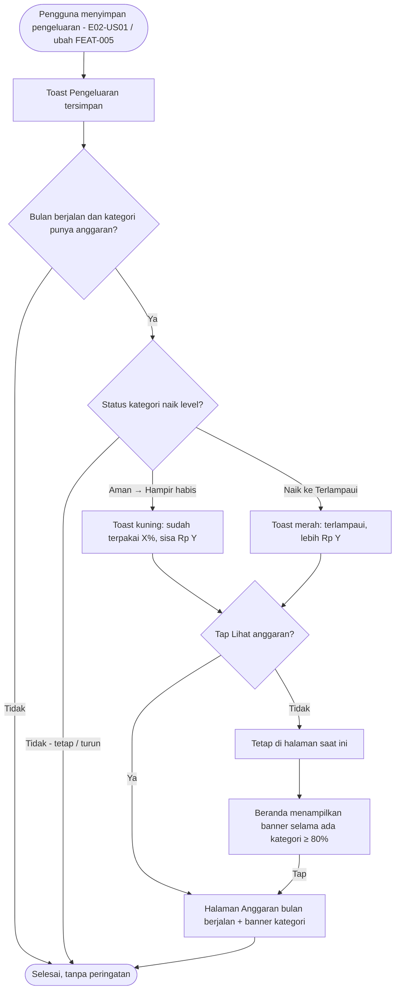

# STORY DESIGN

## Related Story

- Story: `e03-us03--peringatan-anggaran---story.md`
- Epic: `index.md`
- Status: Draft
- Owner: Warsono
- Figma Link: —

## User Flow



## Wireframe Description

- **Toast peringatan:** muncul di atas bottom nav (HP) atau pojok kanan bawah (desktop), tepat setelah toast "Pengeluaran tersimpan". Toast ini tampil lebih lama (±6 detik) dan bisa ditutup manual.
  - Toast kuning berisi ikon ⚠, teks "Anggaran [Kategori] sudah terpakai X%. Sisa Rp Y.", dan tautan **Lihat anggaran**.
  - Toast merah berisi ikon ⛔, teks "Anggaran [Kategori] terlampaui. Lebih Rp Y.", dan tautan **Lihat anggaran**.
- **Banner di Beranda:** berada di bawah header, di atas ringkasan bulan. Isinya kalimat ringkas jumlah kategori yang Terlampaui dan Hampir habis, dengan chevron › menuju halaman Anggaran. Warnanya merah jika ada minimal satu kategori Terlampaui, kuning jika hanya ada yang Hampir habis.
- **Banner di halaman Anggaran:** hanya untuk bulan berjalan, berada di atas kartu ringkasan. Isinya daftar nama kategori per status, misalnya "Terlampaui: Makan & Minum · Hampir habis: Transportasi".
- **Aksesibilitas:** toast diumumkan ke screen reader (`role="status"` untuk kuning, `role="alert"` untuk merah), dan warna selalu disertai ikon serta teks.

## Wireframe

```text
Toast setelah menyimpan pengeluaran (HP):
+--------------------------------------------------+
| ...                                              |
|  +--------------------------------------------+  |
|  | ✓ Pengeluaran tersimpan                    |  |
|  +--------------------------------------------+  |
|  +--------------------------------------------+  |
|  | ⚠ Anggaran Makan & Minum sudah terpakai    |  |(UX-01)
|  |   85%. Sisa Rp 225.000.                    |  |
|  |                  [Lihat anggaran]  [✕]     |  |(UX-02)
|  +--------------------------------------------+  |
| [Beranda] [Transaksi] [Anggaran] [Laporan]       |
+--------------------------------------------------+

Beranda:
+--------------------------------------------------+
| DompetKu                     Oktober 2026 [Akun ▾]|
|  +--------------------------------------------+  |
|  | ⛔ 2 kategori perlu perhatian:              |  |(UX-03)
|  |    1 terlampaui, 1 hampir habis          ›  |  |
|  +--------------------------------------------+  |
| Pengeluaran bulan ini: Rp 3.420.000              |
| ...                                        [ + ] |
+--------------------------------------------------+

Halaman Anggaran (bulan berjalan):
+--------------------------------------------------+
|        [◀]   Oktober 2026   [▶]                   |
|  +--------------------------------------------+  |
|  | ⛔ Terlampaui: Makan & Minum                |  |(UX-04)
|  | ⚠ Hampir habis: Transportasi               |  |
|  +--------------------------------------------+  |
|  | Terpakai Rp 3.420.000 dari Rp 4.500.000    |  |
|  ...                                             |
+--------------------------------------------------+
```

## UX Interaction Markers

| Marker | Component/Input | User Action | Expected Feedback |
|--------|-----------------|-------------|-------------------|
| UX-01 | Toast peringatan (kuning/merah) | — (muncul otomatis setelah simpan) | Muncul hanya jika status kategori naik level; tampil ±6 detik setelah toast "Pengeluaran tersimpan"; teks berisi persentase dan sisa/kelebihan |
| UX-02 | Tautan Lihat anggaran / tombol ✕ di toast | Tap | "Lihat anggaran" membuka halaman Anggaran bulan berjalan; ✕ menutup toast |
| UX-03 | Banner di Beranda | Tap | Membuka halaman Anggaran bulan berjalan; banner hilang sendiri jika tidak ada kategori ≥ 80% |
| UX-04 | Banner di halaman Anggaran | — (tampilan) | Menyebutkan kategori per status; hanya tampil di bulan berjalan |

## States

### Default
Tidak ada kategori ≥ 80%: tidak ada toast peringatan dan tidak ada banner.

### Loading
Tidak ada state loading khusus. Pengecekan status dilakukan sebagai bagian dari proses simpan pengeluaran (E02-US01), dan toast peringatan muncul setelah penyimpanan selesai.

### Empty
Pengguna belum punya anggaran bulan berjalan: tidak ada peringatan dan tidak ada banner.

### Error
Jika penyimpanan pengeluaran gagal, error mengikuti E02-US01 dan tidak ada toast peringatan. Jika data banner gagal dimuat, banner tidak ditampilkan dan halaman tetap berfungsi normal (tidak memblokir).

### Success
Pengguna melihat peringatan tepat saat status kategori naik level, dan banner membantu mengingatkan kategori yang perlu diperhatikan selama bulan berjalan.

## Open UX Questions

- Apakah banner di Beranda perlu bisa ditutup (dismiss) untuk sementara, misalnya sampai ada kategori lain yang naik level?
- Apakah perlu ada pengaturan untuk mematikan peringatan bagi pengguna yang merasa terganggu?

---

<!--
FILE LOCATION: docs/features/phase-01-mvp/e-03---anggaran/e03-us03--peringatan-anggaran---design.md

RELATED FILES:
- e03-us03--peringatan-anggaran---story.md
- e03-us03--peringatan-anggaran---testing.md
-->
