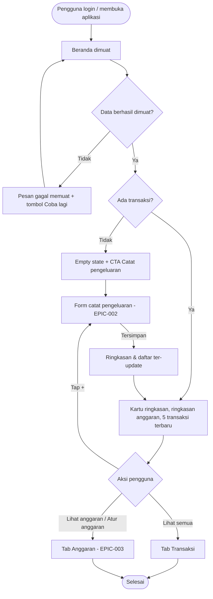

# STORY DESIGN

## Related Story

- Story: `e04-us01--dashboard-ringkasan-bulanan---story.md`
- Epic: `index.md`
- Status: Draft
- Owner: Warsono
- Figma Link: —

## User Flow



## Wireframe Description

- **Header:** logo/nama "DompetKu" di kiri, menu akun di kanan atas.
- **Judul periode:** di bawah header ada judul bulan berjalan, misalnya "Oktober 2026".
- **Kartu ringkasan:** berisi tiga angka, yaitu Pemasukan, Pengeluaran, dan Selisih. Di HP, Pemasukan dan Pengeluaran tampil berdampingan dan Selisih tampil besar di bawahnya. Di desktop ketiganya sejajar.
- **Kartu anggaran:** berisi progress bar total terpakai vs total anggaran dan link "Lihat anggaran". Jika belum ada anggaran, kartu ini diganti ajakan "Atur anggaran bulan ini".
- **Transaksi terbaru:** daftar 5 transaksi terakhir dengan link "Lihat semua" di judul bagian.
- **FAB "+":** ada di pojok kanan bawah, di atas bottom nav.
- **Navigasi:** di HP berupa bottom nav 4 tab (Beranda, Transaksi, Anggaran, Laporan). Di desktop berupa sidebar kiri dengan menu yang sama.

## Wireframe

```text
+--------------------------------------------------+
| DompetKu                                 [👤 ▾]  |
|--------------------------------------------------|
|  Oktober 2026                                    |
|  +--------------------------------------------+  |
|  | Pemasukan           | Pengeluaran          |  | (UX-01)
|  | Rp 8.000.000        | Rp 1.250.000         |  |
|  |--------------------------------------------|  |
|  | Selisih                                    |  |
|  | + Rp 6.750.000  (hijau)                    |  |
|  +--------------------------------------------+  |
|                                                  |
|  Anggaran bulan ini              Lihat anggaran ›| (UX-02)
|  [██████████░░░░░░░░░░░░░░░░] 42%                |
|  Rp 1.250.000 dari Rp 3.000.000                  |
|                                                  |
|  Transaksi terbaru                  Lihat semua ›| (UX-03)
|  12 Okt  🍜 Makan siang           - Rp 25.000    | (UX-04)
|  12 Okt  🚌 Ojek                  - Rp 18.000    |
|  11 Okt  💼 Gaji                + Rp 8.000.000   |
|  10 Okt  🛒 Belanja bulanan      - Rp 450.000    |
|  09 Okt  💡 Listrik              - Rp 350.000    |
|                                            [ + ] | (UX-05)
|--------------------------------------------------|
| [🏠 Beranda] [📋 Transaksi] [🎯 Anggaran] [📊 Laporan] |
+--------------------------------------------------+

Empty state (pengguna baru):
+--------------------------------------------------+
|  Oktober 2026                                    |
|  Pemasukan Rp 0 | Pengeluaran Rp 0 | Selisih Rp 0|
|                                                  |
|            📝                                    |
|   Belum ada transaksi,                           |
|   catat pengeluaran pertamamu                    |
|        [ Catat pengeluaran ]              (UX-06)|
+--------------------------------------------------+
```

## UX Interaction Markers

| Marker | Component/Input | User Action | Expected Feedback |
|--------|-----------------|-------------|-------------------|
| UX-01 | Kartu ringkasan (Pemasukan, Pengeluaran, Selisih) | Melihat | Angka dalam format Rupiah lengkap; Selisih hijau "+" jika positif, merah "−" jika negatif, netral jika nol |
| UX-02 | Kartu anggaran / link "Lihat anggaran" / "Atur anggaran bulan ini" | Tap | Pindah ke tab Anggaran (EPIC-003) |
| UX-03 | Link "Lihat semua" | Tap | Pindah ke tab Transaksi (daftar lengkap bulan berjalan) |
| UX-04 | Baris transaksi terbaru | Melihat | Ikon kategori, catatan (atau nama kategori jika catatan kosong), tanggal, dan nominal bertanda "+"/"−" |
| UX-05 | FAB "+" | Tap | Form catat transaksi terbuka (EPIC-002). Setelah tersimpan, ringkasan dan daftar ter-update |
| UX-06 | Tombol "Catat pengeluaran" (empty state) | Tap | Form catat pengeluaran terbuka (E02-US01) |
| UX-07 | Tombol "Coba lagi" (error) | Tap | Beranda dimuat ulang dengan skeleton loading |

## States

### Default
Kartu ringkasan, kartu anggaran, dan 5 transaksi terbaru bulan berjalan tampil lengkap.

### Loading
Skeleton placeholder berbentuk kartu ringkasan, bar anggaran, dan 5 baris transaksi. Bottom nav dan FAB sudah bisa dipakai.

### Empty
Pengguna tanpa transaksi sama sekali: kartu ringkasan tampil dengan Rp 0, lalu ilustrasi dan teks "Belum ada transaksi, catat pengeluaran pertamamu" dengan tombol "Catat pengeluaran". Jika pengguna punya transaksi di bulan lalu tetapi belum ada di bulan ini, daftar transaksi terbaru tetap menampilkan transaksi terakhir (lintas bulan), sedangkan ringkasan bulan ini bernilai Rp 0.

### Error
Pesan "Gagal memuat ringkasan. Periksa koneksi lalu coba lagi." dengan tombol "Coba lagi". Bottom nav dan FAB tetap bisa dipakai.

### Success
Data tampil lengkap dalam < 2 detik. Setelah transaksi baru dicatat, angka di kartu ringkasan dan daftar transaksi terbaru langsung diperbarui.

## Open UX Questions

- Apakah "5 transaksi terbaru" diambil lintas bulan (seperti di atas) atau hanya transaksi bulan berjalan?
- Apakah perlu menampilkan sisa hari di bulan ini atau rata-rata pengeluaran harian di kartu ringkasan?

---

<!--
FILE LOCATION: docs/features/phase-01-mvp/e-04---laporan-grafik/e04-us01--dashboard-ringkasan-bulanan---design.md

RELATED FILES:
- e04-us01--dashboard-ringkasan-bulanan---story.md
- e04-us01--dashboard-ringkasan-bulanan---testing.md
-->
