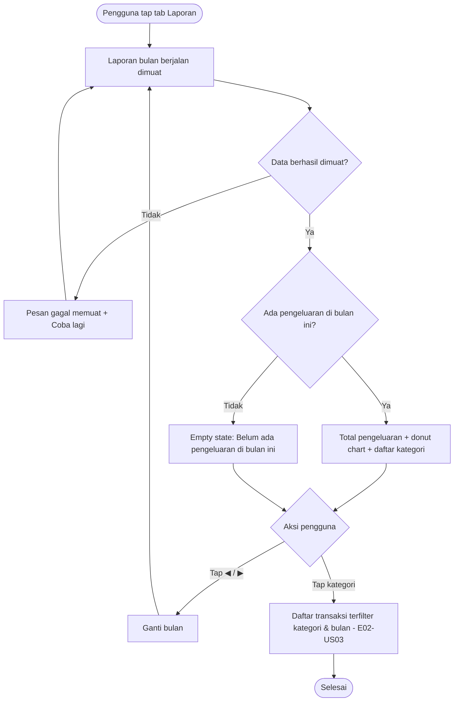

# STORY DESIGN

## Related Story

- Story: `e04-us02--grafik-pengeluaran-kategori---story.md`
- Epic: `index.md`
- Status: Draft
- Owner: Warsono
- Figma Link: —

## User Flow



## Wireframe Description

- **Selector bulan:** di bagian atas tab Laporan ada nama bulan dengan tombol ◀ di kiri dan ▶ di kanan.
- **Total pengeluaran:** tampil di bawah selector, dengan angka besar.
- **Donut chart:** menampilkan porsi tiap kategori. Di tengah donut tertulis total pengeluaran dalam bentuk singkat (misal "Rp 2 jt").
- **Daftar kategori:** tampil di bawah grafik dan diurutkan dari terbesar. Setiap baris berisi titik warna yang sama dengan warna di donut, ikon, nama kategori, persentase, dan nominal lengkap. Tanda "›" menunjukkan baris bisa ditap.
- **Kategori terarsip:** diberi label kecil "(diarsipkan)".
- **Bagian bawah:** di bawah daftar kategori ada ruang untuk grafik tren 6 bulan (E04-US03).
- **Desktop:** donut dan daftar tampil berdampingan (donut di kiri, daftar di kanan).

## Wireframe

```text
+--------------------------------------------------+
| Laporan                                  [👤 ▾]  |
|--------------------------------------------------|
|        [◀]   September 2026   [▶]         (UX-01)|
|                                                  |
|  Total pengeluaran                               |
|  Rp 2.000.000                                    |
|                                                  |
|              .-~~~~~~-.                          |
|            /  ██  ░░   \                  (UX-02)|
|           |   Rp 2 jt   |                        |
|            \  ▓▓  ▒▒   /                         |
|              '-......-'                          |
|                                                  |
|  ● 🍜 Makan & Minum     50,0%   Rp 1.000.000 ›   | (UX-03)
|  ● 🚌 Transportasi      25,0%     Rp 500.000 ›   |
|  ● 💡 Tagihan           15,0%     Rp 300.000 ›   |
|  ● 🎬 Hiburan (diarsipkan) 10,0%  Rp 200.000 ›   |
|                                                  |
|  --- Tren 6 bulan (E04-US03) ---                 |
|--------------------------------------------------|
| [🏠 Beranda] [📋 Transaksi] [🎯 Anggaran] [📊 Laporan] |
+--------------------------------------------------+

Empty state:
+--------------------------------------------------+
|        [◀]   November 2026   [▶ nonaktif]        |
|  Total pengeluaran   Rp 0                        |
|            📊                                    |
|   Belum ada pengeluaran di bulan ini             |
+--------------------------------------------------+
```

## UX Interaction Markers

| Marker | Component/Input | User Action | Expected Feedback |
|--------|-----------------|-------------|-------------------|
| UX-01 | Tombol ◀ / ▶ dan label bulan | Tap | Label bulan berganti, grafik dan daftar menampilkan skeleton lalu data bulan baru; ▶ nonaktif di bulan berjalan |
| UX-02 | Segmen donut chart | Tap (HP) / hover (desktop) | Segmen ter-highlight dan tooltip menampilkan nama kategori, nominal lengkap, dan persentase; tap kedua membuka daftar transaksi terfilter |
| UX-03 | Baris kategori di daftar | Tap | Membuka tab Transaksi dengan filter kategori dan bulan terpilih (E02-US03) |
| UX-04 | Tombol "Coba lagi" (error) | Tap | Laporan dimuat ulang |

## States

### Default
Bulan berjalan dipilih, total pengeluaran, donut chart, dan daftar kategori tampil.

### Loading
Skeleton berbentuk lingkaran (donut) dan 4 baris daftar. Selector bulan tetap bisa dipakai.

### Empty
Bulan tanpa pengeluaran: total "Rp 0", ilustrasi, dan teks "Belum ada pengeluaran di bulan ini". Donut dan daftar tidak ditampilkan.

### Error
Pesan "Gagal memuat laporan. Periksa koneksi lalu coba lagi." dengan tombol "Coba lagi".

### Success
Grafik dan daftar tampil. Setelah tap kategori, pengguna berada di daftar transaksi dengan chip filter kategori dan bulan yang aktif.

## Open UX Questions

- Jika jumlah kategori banyak (> 7), apakah kategori kecil digabung menjadi "Lainnya" di donut (daftar tetap lengkap)?
- Apakah perlu tampilan perbandingan dengan bulan sebelumnya per kategori (misal "▲ 20% dari bulan lalu")? Untuk MVP diusulkan tidak.

---

<!--
FILE LOCATION: docs/features/phase-01-mvp/e-04---laporan-grafik/e04-us02--grafik-pengeluaran-kategori---design.md

RELATED FILES:
- e04-us02--grafik-pengeluaran-kategori---story.md
- e04-us02--grafik-pengeluaran-kategori---testing.md
-->
