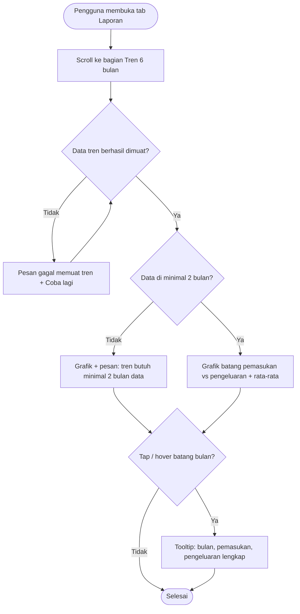

# STORY DESIGN

## Related Story

- Story: `e04-us03--grafik-tren-bulanan---story.md`
- Epic: `index.md`
- Status: Draft
- Owner: Warsono
- Figma Link: —

## User Flow



## Wireframe Description

- **Posisi:** bagian "Tren 6 bulan" berada di bawah daftar kategori pada tab Laporan (E04-US02). Bagian ini tidak terpengaruh oleh selector bulan di atasnya.
- **Grafik:** grafik batang berpasangan per bulan. Batang hijau untuk pemasukan, batang merah untuk pengeluaran.
- **Legenda:** berupa teks di atas grafik.
- **Label sumbu:** sumbu X berisi 6 bulan terakhir, sumbu Y berisi nominal singkat.
- **Rata-rata:** di bawah grafik ada baris "Rata-rata pengeluaran per bulan: Rp 1.500.000".
- **Data belum cukup:** jika data kurang dari 2 bulan, muncul info box kecil di atas grafik.
- **Ukuran layar:** di HP grafik memakai lebar penuh dengan tinggi ±220px. Di desktop grafik lebih lebar.

## Wireframe

```text
+--------------------------------------------------+
|  Tren 6 bulan                                    |
|  ■ Pemasukan   ■ Pengeluaran              (UX-01)|
|                                                  |
|  Rp 8 jt ┤ ▓        ▓         ▓    ▓    ▓        |
|          │ ▓        ▓         ▓    ▓    ▓        |
|  Rp 4 jt ┤ ▓   ▓    ▓         ▓ ░  ▓    ▓        |
|          │ ▓░  ▓░   ▓    ░    ▓ ░  ▓░   ▓░       | (UX-02)
|     Rp 0 ┼─▓░──▓░───▓────░────▓░───▓░───▓░──     |
|           Mei  Jun  Jul  Agu  Sep  Okt           |
|                                                  |
|   +---------------------------------+            |
|   | September 2026                  |     (UX-03)|
|   | Pemasukan    Rp 8.000.000       |            |
|   | Pengeluaran  Rp 3.000.000       |            |
|   +---------------------------------+            |
|                                                  |
|  Rata-rata pengeluaran per bulan: Rp 1.500.000   | (UX-04)
+--------------------------------------------------+

Data < 2 bulan:
+--------------------------------------------------+
|  Tren 6 bulan                                    |
|  ⓘ Tren akan lebih terlihat setelah ada data     |
|    minimal 2 bulan                               |
|  [grafik dengan 5 bulan bernilai Rp 0]           |
+--------------------------------------------------+
```

## UX Interaction Markers

| Marker | Component/Input | User Action | Expected Feedback |
|--------|-----------------|-------------|-------------------|
| UX-01 | Legenda "Pemasukan" / "Pengeluaran" | Melihat | Legenda teks dengan warna yang sesuai. Informasi tidak hanya bergantung pada warna |
| UX-02 | Batang bulan (pasangan pemasukan & pengeluaran) | Tap (HP) / hover (desktop) | Batang ter-highlight dan tooltip muncul |
| UX-03 | Tooltip | Melihat / tap di luar untuk menutup | Nama bulan lengkap, pemasukan, dan pengeluaran dalam format Rupiah lengkap |
| UX-04 | Baris rata-rata | Melihat | "Rata-rata pengeluaran per bulan: Rp X" dalam format lengkap |
| UX-05 | Tombol "Coba lagi" (error) | Tap | Bagian tren dimuat ulang tanpa memuat ulang grafik kategori |

## States

### Default
Grafik 6 bulan dengan legenda dan baris rata-rata.

### Loading
Skeleton berbentuk 6 pasang batang abu-abu.

### Empty
Pengguna dengan data di kurang dari 2 bulan: grafik tetap tampil (bulan tanpa data = Rp 0) disertai info "Tren akan lebih terlihat setelah ada data minimal 2 bulan". Pengguna tanpa transaksi sama sekali melihat grafik dengan semua nilai Rp 0, info yang sama, dan rata-rata Rp 0.

### Error
Pesan "Gagal memuat tren. Coba lagi." dengan tombol "Coba lagi" di dalam bagian tren saja. Grafik kategori di atasnya tidak terpengaruh.

### Success
Grafik, legenda, dan rata-rata tampil. Tooltip muncul saat batang ditap/hover.

## Open UX Questions

- Apakah rata-rata sebaiknya hanya dihitung dari bulan penuh (tanpa bulan berjalan yang belum selesai) agar tidak bias rendah?
- Apakah tap batang bulan sebaiknya juga mengganti selector bulan di atas (membuka laporan kategori bulan itu)?

---

<!--
FILE LOCATION: docs/features/phase-01-mvp/e-04---laporan-grafik/e04-us03--grafik-tren-bulanan---design.md

RELATED FILES:
- e04-us03--grafik-tren-bulanan---story.md
- e04-us03--grafik-tren-bulanan---testing.md
-->
