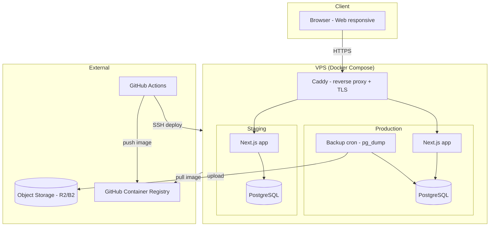
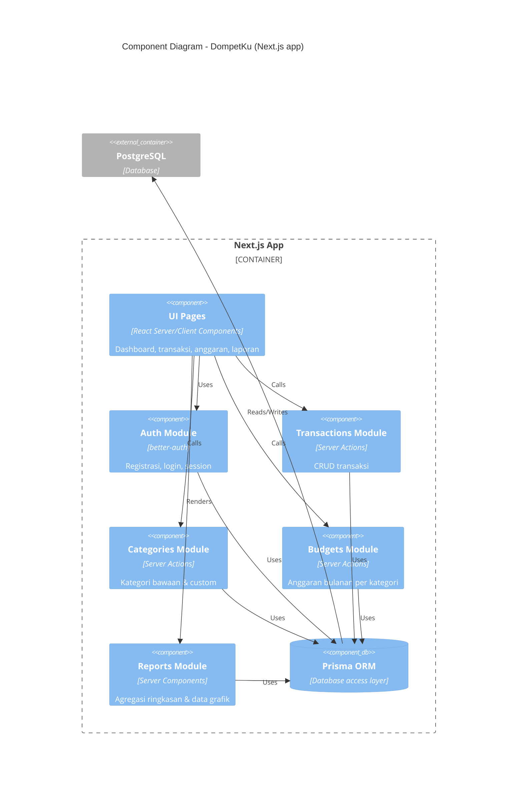
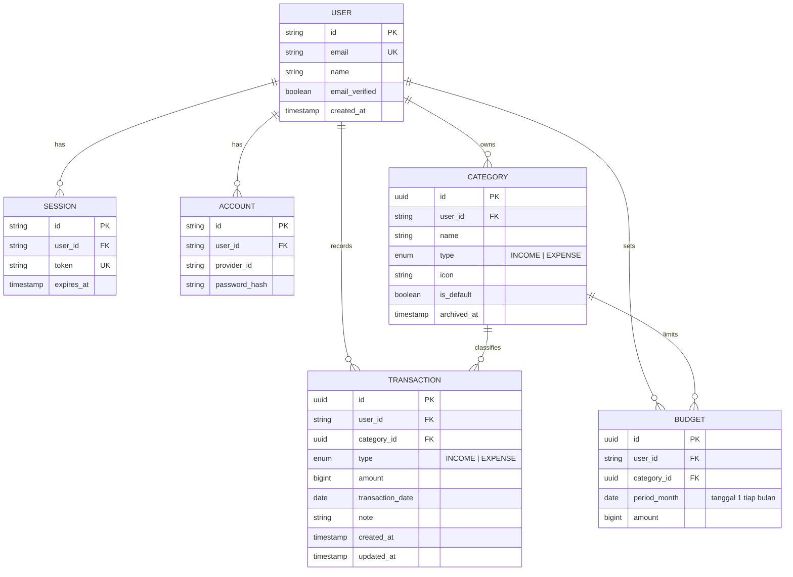
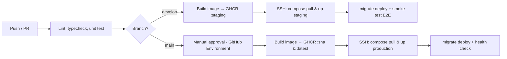

# IMPLEMENTATION & TECHNICAL ARCHITECTURE
## DompetKu

---

| Attribute | Value |
|-----------|-------|
| Document ID | ITA-DMK-001 |
| Version | 1.0 |
| Status | Draft |
| Author | Warsono |
| Created | 2026-09-30 |
| Last Updated | 2026-09-30 |

---

## Changelog

| Version | Date | Author | Changes |
|---------|------|--------|---------|
| 1.0 | 2026-09-30 | Warsono | Versi awal |

---

## 1. Architecture Principles

| Principle | Description | Rationale |
|-----------|-------------|-----------|
| Simple monolith | Satu aplikasi Next.js fullstack (UI + server logic) dengan satu database | Tim solo dengan timeline 1 bulan; satu codebase dan satu deploy meminimalkan overhead |
| Security by design | Setiap query data wajib di-scope ke `user_id` milik session; tidak ada endpoint tanpa autentikasi selain halaman auth | Data keuangan pribadi harus hanya bisa diakses pemiliknya (BRD §6) |
| Mobile-first | UI dirancang untuk layar HP lebih dulu, lalu diperluas ke desktop | Pencatatan transaksi paling sering dilakukan dari HP (BO-02: < 15 detik) |
| Modular by domain | Kode dikelompokkan per domain (`auth`, `transactions`, `categories`, `budgets`, `reports`) | Memudahkan pemisahan menjadi API formal jika nanti ada aplikasi mobile |
| Boring infrastructure | Docker Compose di satu VPS, tanpa cache/queue tambahan di MVP | Beban rendah (pengguna personal); komponen tambahan hanya jika terbukti dibutuhkan |

---

## 2. System Architecture

### 2.1 High-Level Architecture (ASCII)

```
┌──────────────────────────────────────────────────────────────┐
│                           CLIENT                              │
│        Browser (HP / Tablet / Desktop) — Web responsive       │
└──────────────────────────────┬───────────────────────────────┘
                               │ HTTPS
┌──────────────────────────────┼───────────────────────────────┐
│  VPS (Docker Compose)        │                                │
│                     ┌────────▼────────┐                       │
│                     │      Caddy      │  • TLS otomatis (LE)  │
│                     │  reverse proxy  │  • Security headers   │
│                     └───┬─────────┬───┘                       │
│          dompetku.xxx   │         │  staging.dompetku.xxx     │
│   ┌─────────────────────▼──┐   ┌──▼─────────────────────┐     │
│   │ app (Next.js) — PROD   │   │ app (Next.js) — STAGING│     │
│   │ ┌──────┐ ┌───────────┐ │   │   (image & struktur    │     │
│   │ │ UI   │ │ Server    │ │   │    sama dengan prod)   │     │
│   │ │ RSC  │ │ Actions / │ │   └──────────┬─────────────┘     │
│   │ │      │ │ Route Hdl │ │              │                   │
│   │ └──────┘ └─────┬─────┘ │              │                   │
│   │   better-auth  │Prisma │              │                   │
│   └────────────────┼───────┘              │                   │
│   ┌────────────────▼───────┐   ┌──────────▼─────────────┐     │
│   │ PostgreSQL — PROD      │   │ PostgreSQL — STAGING   │     │
│   └────────────────┬───────┘   └────────────────────────┘     │
│   ┌────────────────▼───────┐                                  │
│   │ backup (cron pg_dump)  │                                  │
│   └────────────────┬───────┘                                  │
└────────────────────┼─────────────────────────────────────────┘
                     │ S3 API
            ┌────────▼─────────┐
            │ Object Storage   │  (Cloudflare R2 / Backblaze B2)
            │ backup harian    │
            └──────────────────┘
```

### 2.2 Architecture Diagram (Mermaid)



### 2.3 Component Diagram



---

## 3. Technology Stack

> Versi di bawah adalah versi mayor minimum. Versi pasti di-pin di `package.json` / `docker-compose.yaml` saat setup di Sprint 0.

### 3.1 Core Technologies

| Layer | Technology | Version | Purpose |
|-------|------------|---------|---------|
| **Runtime** | Node.js | LTS terbaru (≥ 22) | Runtime aplikasi |
| **Language** | TypeScript | 5.x | Type safety end-to-end |
| **Frontend + Backend** | Next.js (App Router) | stabil terbaru | UI (RSC), Server Actions, Route Handlers |
| **Database** | PostgreSQL | ≥ 16 | Primary data store |
| **Mobile** | — | — | Tidak ada di MVP (web responsive) |
| **Cache / Queue** | — | — | Tidak dibutuhkan di MVP |

### 3.2 Supporting Technologies

| Category | Technology | Purpose |
|----------|------------|---------|
| ORM & Migration | Prisma | Akses database, schema, dan migration |
| Auth | better-auth (+ Prisma adapter) | Email & password, database session, rate limit endpoint auth |
| Validation | Zod | Validasi input Server Actions & form |
| UI | Tailwind CSS + shadcn/ui | Komponen UI yang mobile-friendly |
| Form | React Hook Form + Zod resolver | Form transaksi dan anggaran |
| Chart | Recharts | Grafik per kategori (pie/bar) dan tren (line) |
| Reverse proxy | Caddy 2 | HTTPS otomatis (Let's Encrypt), security headers |
| Backup | `pg_dump` + cron + client S3 (rclone/aws-cli) | Backup harian ke object storage |
| Monitoring | Uptime monitor eksternal (misal UptimeRobot) + log Docker | Alert jika aplikasi down; cukup untuk MVP |

### 3.3 Development Tools

| Tool | Purpose |
|------|---------|
| pnpm | Package manager |
| Docker & Docker Compose | PostgreSQL lokal, staging, dan production |
| ESLint + Prettier | Linting & formatting |
| Vitest | Unit test |
| Playwright | E2E test (`test/web/`) |
| GitHub Actions | CI/CD |
| Git + GitHub | Version control & container registry (GHCR) |

---

## 4. Data Architecture

### 4.1 Database Strategy

| Aspect | Decision |
|--------|----------|
| Database Type | Relational (PostgreSQL) |
| Schema Strategy | Single schema; isolasi data per pengguna melalui kolom `user_id` di setiap tabel milik user |
| Migration Tool | Prisma Migrate (`prisma migrate deploy` saat deploy) |
| Tipe nominal uang | `BIGINT` dalam satuan Rupiah penuh (tanpa desimal) untuk menghindari error floating point |
| Zona waktu | Timestamp disimpan dalam UTC; tanggal transaksi disimpan sebagai `DATE`; periode bulan dihitung dengan zona `Asia/Jakarta` |
| Backup Strategy | `pg_dump` harian (02:00 WIB) ke object storage S3-compatible, retensi 14 hari; uji restore minimal 1x sebelum go-live |

### 4.2 Core Entities (High-Level)



Catatan desain:
- `USER`, `SESSION`, `ACCOUNT` mengikuti skema bawaan better-auth.
- Kategori bawaan di-*seed* per user saat registrasi (`is_default = true`), sehingga semua kategori punya `user_id` dan aturan isolasi datanya seragam.
- Kategori yang sudah dipakai transaksi tidak dihapus permanen, tetapi diarsipkan (`archived_at`).
- `BUDGET` memiliki unique constraint `(user_id, category_id, period_month)`.
- Index utama: `TRANSACTION (user_id, transaction_date)` dan `TRANSACTION (user_id, category_id, transaction_date)` untuk laporan bulanan.

> **Note:** Detailed entities per feature are defined in each SPEC-Technical document.

### 4.3 Caching Strategy

Tidak ada cache layer terpisah (Redis) di MVP. Volume data per user kecil, dan query agregasi bulanan dengan index di atas cukup untuk memenuhi target dashboard < 2 detik.

| Data Type | Cache Location | TTL | Invalidation |
|-----------|----------------|-----|--------------|
| Session | PostgreSQL (tabel `session`) | 7 hari (sliding) | Saat logout / kedaluwarsa |
| Halaman data user | Tidak di-cache (dynamic rendering) | — | `revalidatePath` setelah mutasi |
| Aset statis (JS/CSS/font) | Browser + Caddy | Immutable (hash filename) | Otomatis saat build baru |

---

## 5. API Architecture

### 5.1 API Conventions

MVP tidak mengekspos public REST API. UI berkomunikasi dengan server melalui **Server Actions** (mutasi) dan **React Server Components** (baca data). Route Handler hanya dipakai untuk endpoint yang memang butuh URL.

| Aspect | Standard |
|--------|----------|
| Mutasi data | Server Actions per domain (`src/modules/<domain>/actions.ts`), input divalidasi Zod |
| Baca data | Server Components memanggil query function di `src/modules/<domain>/queries.ts` |
| Route Handlers | `/api/auth/*` (better-auth), `/api/health` (health check untuk deploy & uptime monitor) |
| Authentication | Session cookie better-auth (`HttpOnly`, `Secure`, `SameSite=Lax`) |
| Otorisasi | Setiap action/query mengambil `userId` dari session di server, bukan dari input client |
| Masa depan | Jika ada aplikasi mobile: tambahkan REST `/api/v1` (kebab-case, plural nouns, OpenAPI 3.0) di atas query/action yang sama |

### 5.2 API Documentation

Tidak ada public API di MVP, sehingga belum ada Swagger/OpenAPI. Kontrak Server Action didokumentasikan lewat tipe TypeScript dan schema Zod, serta di technical spec per fitur.

| Environment | URL |
|-------------|-----|
| Local | `http://localhost:3000` |
| Staging | `https://staging.<domain>` |
| Production | `https://<domain>` |

### 5.3 Standard Response Format

Semua Server Action mengembalikan result object yang konsisten:

**Success:**
```json
{
  "success": true,
  "data": { ... }
}
```

**Error:**
```json
{
  "success": false,
  "error": {
    "code": "VALIDATION_ERROR",
    "message": "Nominal harus lebih dari 0",
    "details": [{ "field": "amount", "message": "..." }]
  }
}
```

Kode error standar: `VALIDATION_ERROR`, `UNAUTHORIZED`, `NOT_FOUND`, `CONFLICT`, `INTERNAL_ERROR`. Pesan error untuk pengguna ditulis dalam Bahasa Indonesia.

---

## 6. Security Architecture

### 6.1 Authentication & Authorization

| Aspect | Implementation |
|--------|----------------|
| Auth Method | better-auth, email + password, database session |
| Session TTL | 7 hari, diperpanjang otomatis saat aktif; dicabut saat logout |
| Password Hashing | Algoritma bawaan better-auth (scrypt); minimal 8 karakter |
| Rate limiting | Rate limiter bawaan better-auth untuk endpoint login/registrasi |
| Authorization | Owner-based: setiap record punya `user_id`, dan semua query difilter berdasarkan `userId` dari session |
| Route protection | Middleware Next.js mengarahkan user tanpa session ke `/login`; pengecekan session tetap diulang di setiap action/query (defense in depth) |

### 6.2 Security Measures

- [x] HTTPS everywhere (TLS otomatis via Caddy, HSTS)
- [x] Rate limiting endpoint auth (better-auth) + limit dasar di Caddy
- [x] Input validation & sanitization (Zod di semua Server Action)
- [x] SQL injection prevention (Prisma, tanpa raw query yang tidak diparameterisasi)
- [x] XSS prevention (React output escaping, tanpa `dangerouslySetInnerHTML`)
- [x] CSRF protection (Server Actions origin check + cookie `SameSite=Lax`)
- [x] Security headers (CSP, HSTS, X-Frame-Options, Referrer-Policy) di Caddy
- [x] Secret hanya di environment variable server, tidak pernah di client bundle
- [x] PostgreSQL tidak diekspos ke publik (hanya network internal Docker)
- [x] Firewall VPS: hanya port 22 (SSH key-only), 80, 443
- [ ] Audit logging — tidak di MVP (single user per akun)

### 6.3 Role Definitions

| Role | Description | Access Level |
|------|-------------|--------------|
| User | Pengguna terdaftar | Hanya data milik sendiri |
| Guest | Belum login | Halaman login & registrasi saja |

Tidak ada peran admin di aplikasi pada MVP. Administrasi server dilakukan langsung di VPS.

---

## 7. Development Environment

### 7.1 Quick Start

```bash
# 1. Clone & setup
git clone <repository-url>
cd dompetku
cp .env.example .env
pnpm install

# 2. Start database & app
docker compose up -d db
pnpm db:migrate
pnpm db:seed
pnpm dev

# 3. Access
# - Web: http://localhost:3000
```

### 7.2 Commands

| Command | Description |
|---------|-------------|
| `pnpm dev` | Jalankan Next.js dev server |
| `pnpm build` / `pnpm start` | Build & jalankan mode production |
| `pnpm lint` | ESLint + typecheck |
| `pnpm test` | Unit test (Vitest) |
| `pnpm test:e2e` | E2E test (Playwright) |
| `pnpm db:migrate` | `prisma migrate dev` |
| `pnpm db:seed` | Isi data contoh (user demo + transaksi) |
| `docker compose up -d db` | Jalankan PostgreSQL lokal |

### 7.3 Environment Variables

See `.env.example` for the full list. Key categories:

| Category | Variables | Description |
|----------|-----------|-------------|
| **App** | `NODE_ENV`, `PORT`, `APP_URL` | Pengaturan aplikasi |
| **Database** | `DATABASE_URL` | Koneksi PostgreSQL |
| **Auth** | `BETTER_AUTH_SECRET`, `BETTER_AUTH_URL` | Konfigurasi better-auth |
| **Backup** | `S3_ENDPOINT`, `S3_BUCKET`, `S3_ACCESS_KEY_ID`, `S3_SECRET_ACCESS_KEY` | Tujuan backup (hanya di VPS) |

> **Note:** Do not commit `.env` files. Use `.env.example` as a template.

---

## 8. DevOps & Deployment

### 8.1 Environments

| Environment | Purpose | Config File |
|-------------|---------|-------------|
| Development | Local development | `docker-compose.yaml` (DB saja) + `pnpm dev` |
| Staging | Testing & UAT | `deploy/docker-compose.staging.yaml`, compose project `dompetku-staging` |
| Production | Live system | `deploy/docker-compose.production.yaml`, compose project `dompetku-prod` |

Staging dan production berjalan di **satu VPS** sebagai compose project terpisah, masing-masing dengan database sendiri. Satu instance Caddy melayani keduanya berdasarkan hostname. Spesifikasi VPS minimal: 1 vCPU, 2 GB RAM, 25 GB SSD.

> **Note:** Detail IP, domain, dan kredensial production tidak ditulis di repo.

### 8.2 CI/CD Overview



- Migration dijalankan dengan `prisma migrate deploy` sebagai langkah terpisah sebelum container app baru dinyalakan.
- Rollback dilakukan dengan deploy ulang tag image sebelumnya (`:sha`).

### 8.3 Branching Strategy

| Branch | Purpose | Deploys To |
|--------|---------|------------|
| `main` | Production-ready code | Production (manual approval) |
| `develop` | Integration branch | Staging (otomatis) |
| `feature/*` | Feature development | - |
| `hotfix/*` | Production fixes | Production (after merge) |

---

## 9. Coding Standards

### 9.1 Naming Conventions

| Item | Convention | Example |
|------|------------|---------|
| Files | kebab-case | `transaction-form.tsx` |
| React components | PascalCase | `TransactionForm` |
| Functions | camelCase | `createTransaction()` |
| Variables | camelCase | `monthlyTotal` |
| Constants | SCREAMING_SNAKE | `MAX_NOTE_LENGTH` |
| Database tables | snake_case (via Prisma `@@map`) | `transactions` |
| Routes (URL) | kebab-case | `/transactions`, `/budgets` |
| Import alias | `~/*` → `src/*` | `import { TransactionForm } from "~/components/transactions/transaction-form"` |
| Lokasi komponen | `~/components/<module>/**` | `~/components/budgets/budget-progress.tsx` |

Struktur folder (acuan):
```
src/
├── app/                  # Routes (App Router)
├── components/
│   ├── ui/               # shadcn/ui
│   └── <module>/**       # Komponen per modul: layout, auth, transactions, categories, budgets, reports
├── modules/<domain>/     # Logika server (actions.ts, queries.ts) + schema.ts (Zod, isomorfik: boleh di-import komponen client)
└── lib/                  # auth, prisma client, format Rupiah, util tanggal
prisma/                   # schema.prisma, migrations, seed
test/web/                 # Playwright (struktur HAIE)
deploy/                   # compose files, Caddyfile, backup script
```

### 9.2 Commit Convention

```
<type>(<scope>): <subject>

Types:
- feat: New feature
- fix: Bug fix
- docs: Documentation
- refactor: Code restructuring
- test: Adding tests
- chore: Maintenance

Example:
feat(transactions): add quick expense form
```

### 9.3 Code Review Requirements

- [ ] Follows coding standards
- [ ] Has appropriate tests
- [ ] No security vulnerabilities (terutama query selalu ter-scope `userId`)
- [ ] Error handling implemented
- [ ] Performance considered
- [ ] Documentation updated (if needed)

---

## 10. Approval

| Role | Name | Signature | Date |
|------|------|-----------|------|
| Solution Architect / Tech Lead | Warsono | | |
| Project Manager | Warsono | | |

---

## Related Documents

| Document | Description |
|----------|-------------|
| `docs/project/01-BRD.md` | Business requirements |
| `docs/project/02-PEP.md` | Project execution plan |
| `deploy/` | Konfigurasi staging & production (tanpa secret) |
| `docs/features/*/e-*/*---technical.md` | Feature technical specs |
